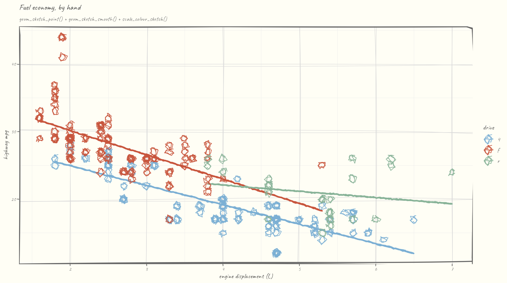
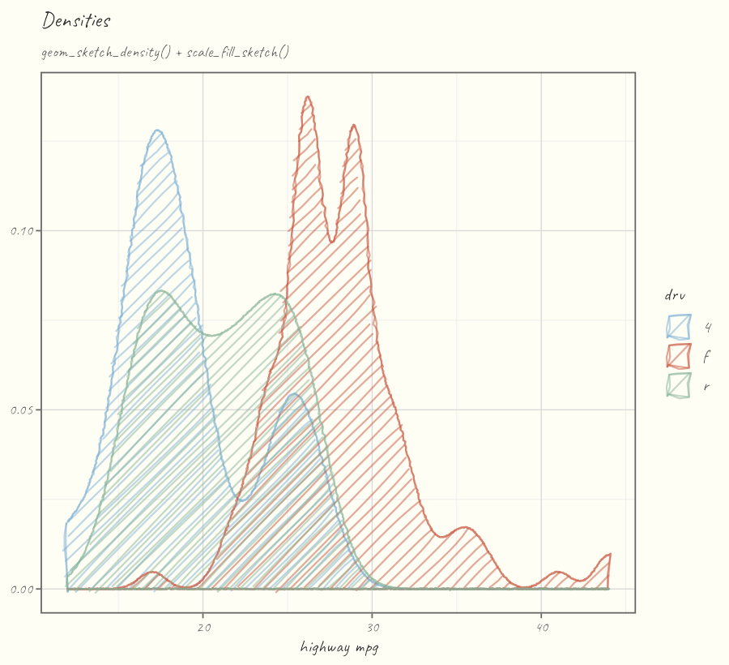
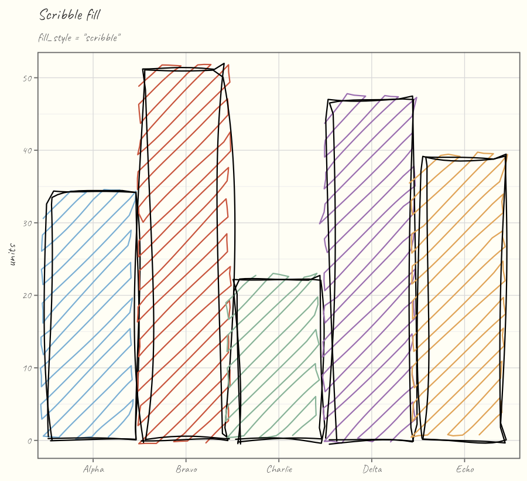
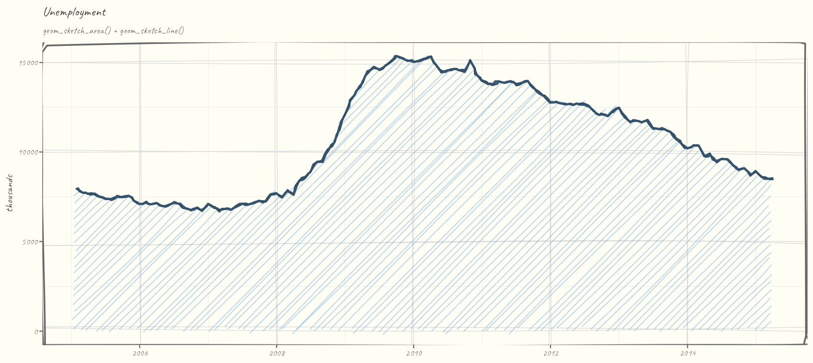

# ggsketch 

<!-- badges: start -->

[](https://github.com/orijitghosh/ggsketch/actions/workflows/check.yaml) [](https://lifecycle.r-lib.org/articles/stages.html#experimental) [](https://opensource.org/licenses/MIT) [](https://orijitghosh.github.io/ggsketch/)

<!-- badges: end -->

> Grammar-native, hand-drawn geoms for **ggplot2** - the rough.js sketch aesthetic in **pure R**, with no JavaScript and no browser.

<p align="center">


</p>

`ggsketch` gives you ggplot2 geoms (`geom_sketch_col()`, `geom_sketch_line()`, `geom_sketch_point()`, …) that render with a wobbly, hand-drawn look: roughened double-stroke outlines and hachure / cross-hatch / zigzag / dots / dashed fills. Because the geoms are real grid grobs wrapped in `ggproto`, they compose with `aes()`, stats, scales, facets, and coords, and draw correctly on **every** R graphics device — screen, PNG, PDF, and SVG.

## Why another sketch package?

|   | ggsketch | [ggrough](https://github.com/xvrdm/ggrough) |
|------------------------|------------------------|------------------------|
| Approach | **Native ggplot2 geoms** (grid grobs) | Post-hoc convert a finished plot to SVG, redraw in HTML Canvas |
| Output | Any device: screen / PNG / **PDF** / SVG | HTML widget only (breaks static PDF/PNG) |
| Composes with `aes()` / stats / scales / facets | Yes | No (operates on the rendered plot) |
| JavaScript / browser | None | Requires rough.js in a browser |
| Status | Active | Maintainer marks it dormant ("doesn't work with recent releases of ggplot2") |

The `ggrough` maintainer himself notes that "a nice way to create sketchy visualisations would be a neat addition to the {ggplot2} ecosystem." `ggsketch` fills that gap with native geoms.

## Installation

``` r
# install.packages("pak")
pak::pak("orijitghosh/ggsketch")
```

`ggsketch` is pure R (`NeedsCompilation: no`); its only hard dependencies are ggplot2, grid, rlang, scales, cli, and withr.

Full documentation and a gallery of every geom: <https://orijitghosh.github.io/ggsketch/>.

## Quick start

``` r
library(ggplot2)
library(ggsketch)

df <- data.frame(product = c("Alpha","Bravo","Charlie","Delta"),
                 units   = c(34, 51, 22, 47))

ggplot(df, aes(product, units)) +
  geom_sketch_col(fill = "#7BAFD4", seed = 1L) +
  labs(title = "Units sold") +
  theme_sketch()
```

Every randomized routine is seeded, so a given `seed` always produces the same wobble — your plots are reproducible. Set a session-wide default with `options(ggsketch.seed = 1L)`.

## Showcase

A scatter with a hand-drawn frame (`theme_sketch(rough_frame = TRUE)`), the sketch colour palette, and a roughened linear fit:

<p align="center">



</p>

Overlapping densities and the new `"scribble"` fill, both on the sketch palette:

<p align="center">

 

</p>

A filled area and line over time, again with a roughened frame:

<p align="center">



</p>

## The geoms

| Family | Geoms |
|------------------------------------|------------------------------------|
| Lines & points | `geom_sketch_line()`, `geom_sketch_path()`, `geom_sketch_point()` |
| Bars & tiles | `geom_sketch_col()`, `geom_sketch_bar()`, `geom_sketch_rect()`, `geom_sketch_tile()` |
| Areas & curves | `geom_sketch_polygon()`, `geom_sketch_ribbon()`, `geom_sketch_area()`, `geom_sketch_density()`, `geom_sketch_smooth()` |
| Circular & composed | `geom_sketch_circle()`, `geom_sketch_ellipse()`, `geom_sketch_segment()`, `geom_sketch_step()`, `geom_sketch_boxplot()` |
| Helpers | `annotate_sketch()`, `theme_sketch()` |
| Frame & scales | `element_sketch_line()`, `element_sketch_rect()` (via `theme_sketch(rough_frame = TRUE)`), `scale_colour_sketch()`, `scale_fill_sketch()`, `register_sketch_font()` |

### Shared sketch parameters

| Parameter | Meaning |
|------------------------------------|------------------------------------|
| `roughness` | How far points are jittered (0 = ruler-straight, \~1 default, \>3 loose) |
| `bowing` | How much segments bow outward |
| `n_passes` | Overlaid strokes (2 = the classic "double stroke") |
| `seed` | Integer for reproducible wobble |
| `fill_style` | `"hachure"`, `"cross_hatch"`, `"zigzag"`, `"zigzag_line"`, `"scribble"`, `"dots"`, `"dashed"`, `"solid"` |
| `hachure_angle`, `hachure_gap`, `fill_weight` | Fill line angle, spacing, and weight |

## How it works

Three layers, kept strictly separate:

1.  **Layer 1 — pure geometry** (`R/core-*.R`): numbers → numbers. Seeded roughening, ellipse/Bézier sampling, and an Active-Edge-Table scan-line hachure filler that handles **concave** polygons. No grid, no ggplot2.
2.  **Layer 2 — grid grobs** (`R/grob-*.R`): `makeContent()` converts to device inches and re-roughens at the real render size, so resizing re-draws cleanly.
3.  **Layer 3 — ggproto geoms** (`R/geom-*.R`): standard ggplot2 extension API.

Roughening always happens in **inch space**, so the look is consistent across aspect ratios and devices.

## Credits & non-affiliation

The algorithms are reimplemented in original R from the **published descriptions** of the [rough.js](https://github.com/rough-stuff/rough) algorithms ([Preet Shihn, 2020](https://shihn.ca/posts/2020/roughjs-algorithms/)) and the hachure approach of Wood et al. **No rough.js source is vendored, copied, or translated, and no JavaScript ships in this package.** See [`inst/NOTICE`](inst/NOTICE).

> **ggsketch is an independent R package reimplementing the hand-drawn sketch aesthetic from first principles. It is not affiliated with, derived from, or endorsed by the rough.js project, ggrough, or any related JavaScript libraries.**

rough.js is © Preet Shihn and licensed MIT. ggsketch is licensed MIT.
