# Controlling the sketch

Every sketch geom shares four parameters that shape the hand-drawn look:
`roughness`, `bowing`, `n_passes`, and `seed`. They are layer parameters
(not aesthetics), so you pass them to the `geom_sketch_*()` call.

## `roughness`

How far points are displaced. `0` is ruler-straight; the default is `1`;
values above `~3` get loose and scribbly.

``` r

x  <- seq(0, 10, length.out = 50)
d  <- data.frame(x = x, y = sin(x))

ggplot(d, aes(x, y)) +
  geom_sketch_line(aes(colour = "0.0  (straight)"), roughness = 0,   seed = 2) +
  geom_sketch_line(aes(colour = "1.0  (default)"),  roughness = 1,   seed = 2) +
  geom_sketch_line(aes(colour = "2.5"),             roughness = 2.5, seed = 2) +
  geom_sketch_line(aes(colour = "5.0  (loose)"),    roughness = 5,   seed = 2) +
  scale_colour_brewer("roughness", palette = "Set1") +
  labs(title = "The roughness dial") +
  theme_sketch()
```

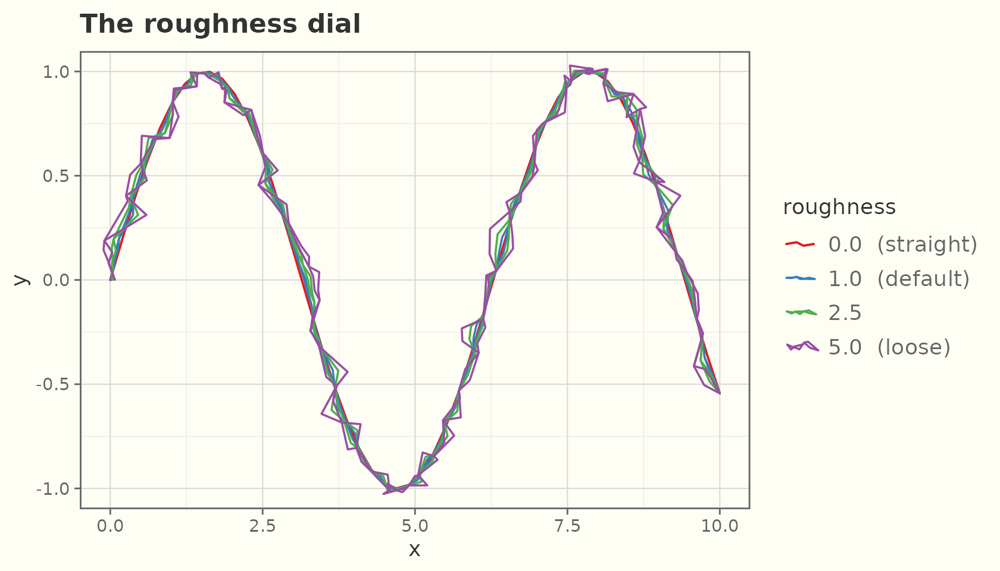

On bars:

``` r

df <- data.frame(x = c("A", "B", "C"), y = c(4, 6, 3))
for (r in c(0, 1, 3)) {
  print(
    ggplot(df, aes(x, y)) +
      geom_sketch_col(fill = "#7BAFD4", roughness = r, seed = 1L) +
      labs(subtitle = paste("roughness =", r), x = NULL) +
      theme_sketch(base_size = 9)
  )
}
```

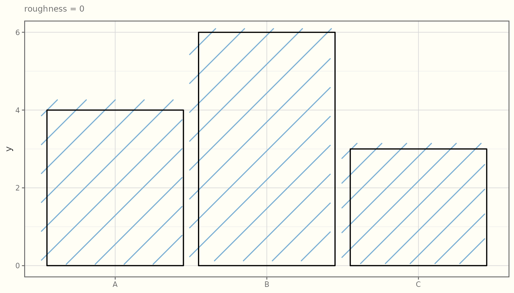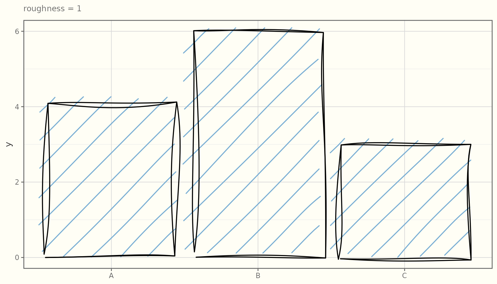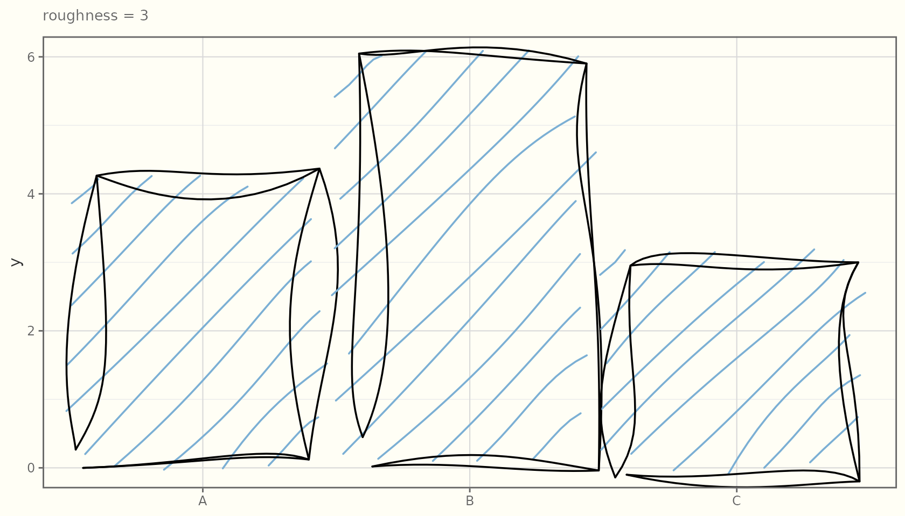

## `bowing`

How much line segments bow (curve) between their endpoints. Higher
values give a springier, more relaxed stroke.

``` r

seg <- data.frame(x = 1, y = 1, xend = 6, yend = 4)
for (b in c(0, 2, 5)) {
  print(
    ggplot(seg) +
      geom_sketch_segment(aes(x = x, y = y, xend = xend, yend = yend),
                          bowing = b, roughness = 0.6, linewidth = 1,
                          seed = 7L) +
      labs(subtitle = paste("bowing =", b)) +
      theme_sketch(base_size = 9)
  )
}
```

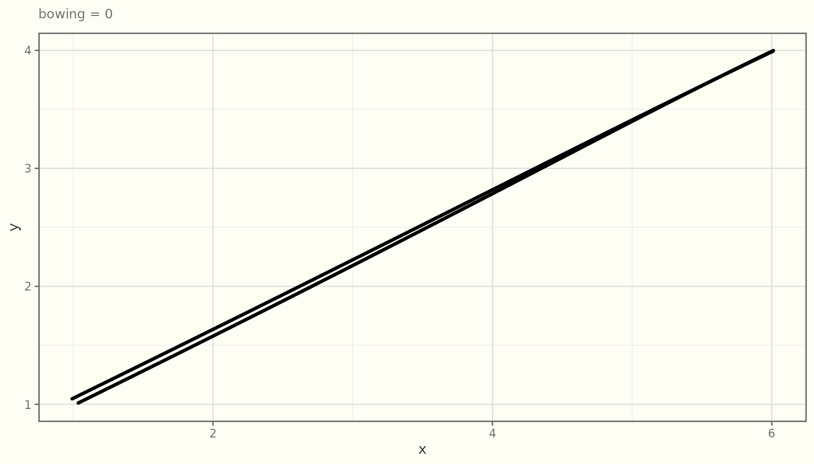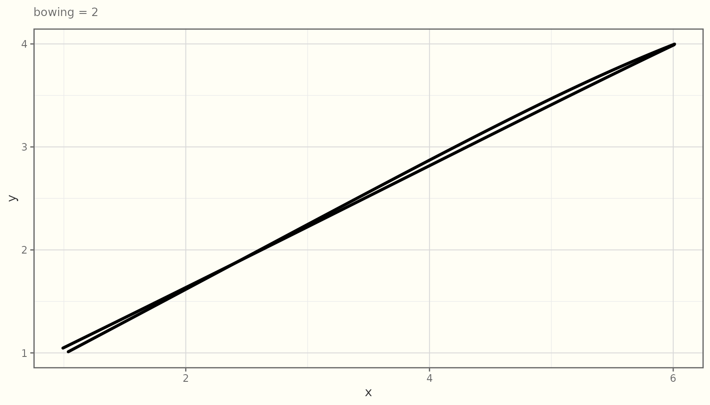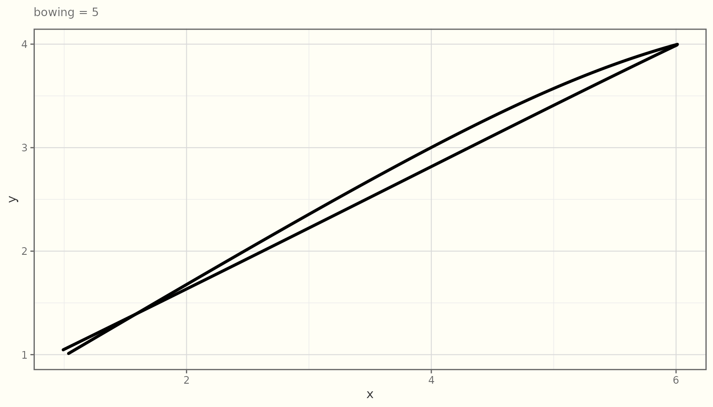

## `n_passes`

How many overlaid strokes to draw. `2` (the default) gives the classic
“double-stroke” sketch look; `1` is a single pass; `3+` looks heavily
worked.

``` r

for (n in c(1, 2, 4)) {
  print(
    ggplot(d, aes(x, y)) +
      geom_sketch_line(n_passes = n, roughness = 1.5, linewidth = 0.7,
                       colour = "grey20", seed = 3L) +
      labs(subtitle = paste("n_passes =", n)) +
      theme_sketch(base_size = 9)
  )
}
```

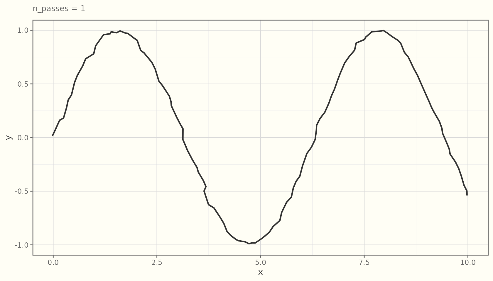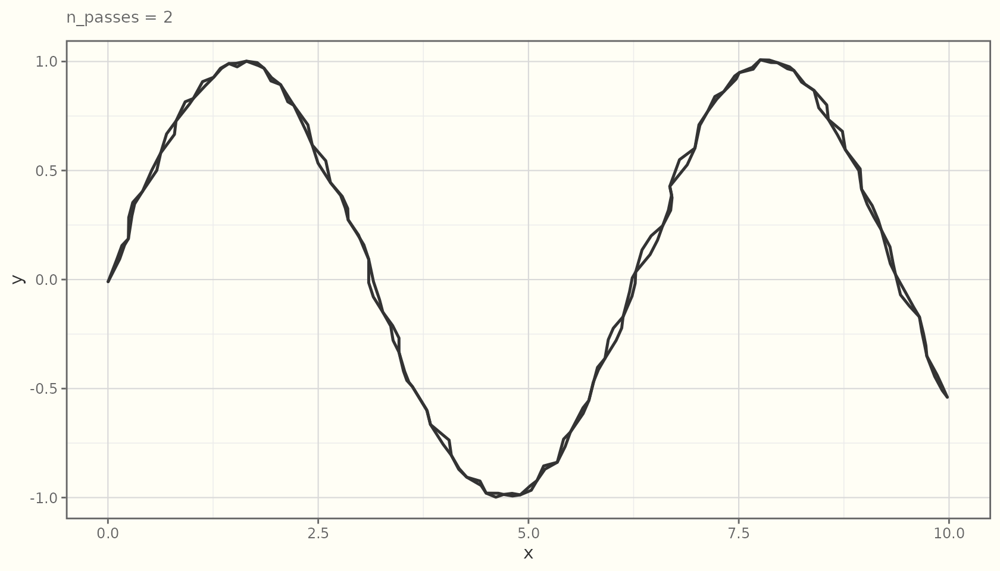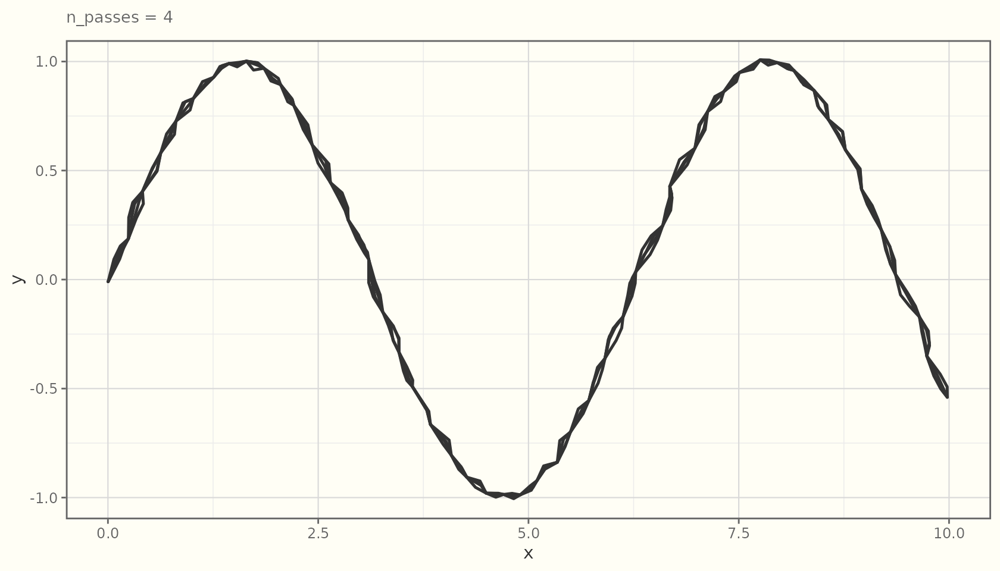

## `medium` (line geoms)

The line family —
[`geom_sketch_line()`](https://orijitghosh.github.io/ggsketch/reference/geom_sketch_line.md),
[`geom_sketch_path()`](https://orijitghosh.github.io/ggsketch/reference/geom_sketch_path.md),
[`geom_sketch_segment()`](https://orijitghosh.github.io/ggsketch/reference/geom_sketch_segment.md),
[`geom_sketch_step()`](https://orijitghosh.github.io/ggsketch/reference/geom_sketch_segment.md)
— also takes a `medium`, which sets *how* the stroke is laid down: a
tapering pencil, a wet ink line, a crisp fountain pen, a thin ballpoint,
a broad brush, charcoal, soft pastel, dusty chalk (best on
`paper = "chalkboard"`), marker, a translucent highlighter band, or
crayon.
[`sketch_media()`](https://orijitghosh.github.io/ggsketch/reference/sketch_media.md)
lists them.

``` r

for (m in c("pencil", "ink", "brush", "charcoal")) {
  print(
    ggplot(d, aes(x, y)) +
      geom_sketch_line(medium = m, linewidth = 1.2, seed = 2L) +
      labs(subtitle = paste("medium =", m)) +
      theme_sketch(base_size = 9)
  )
}
```

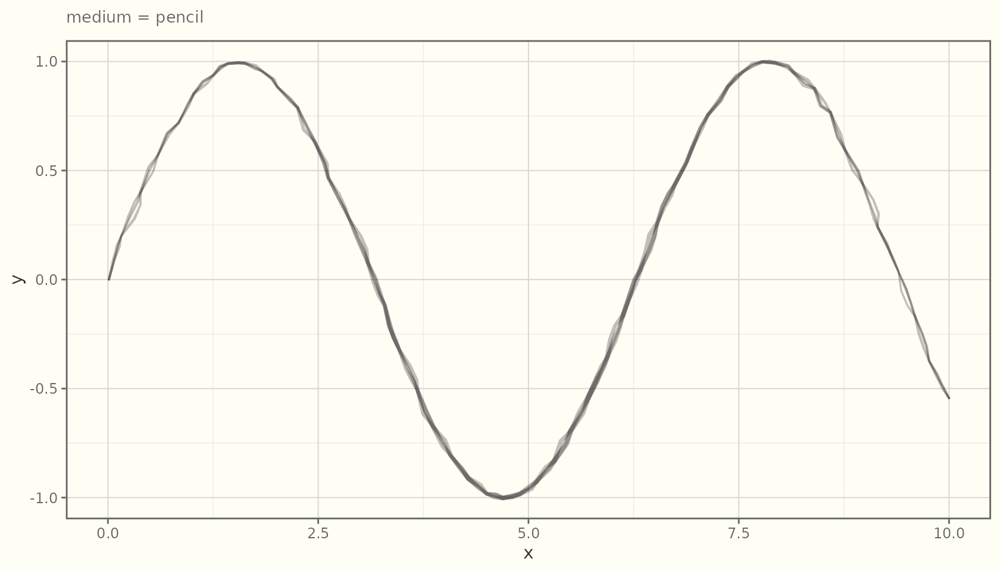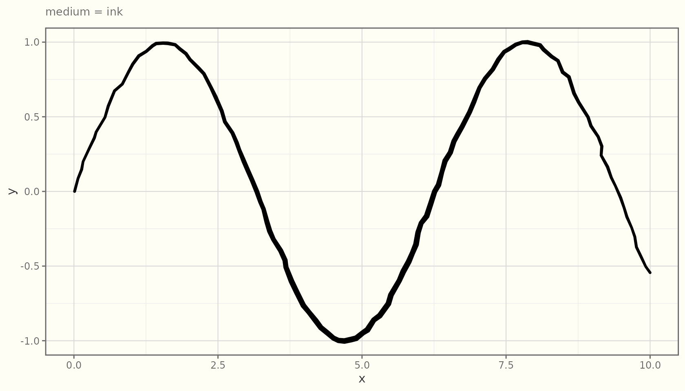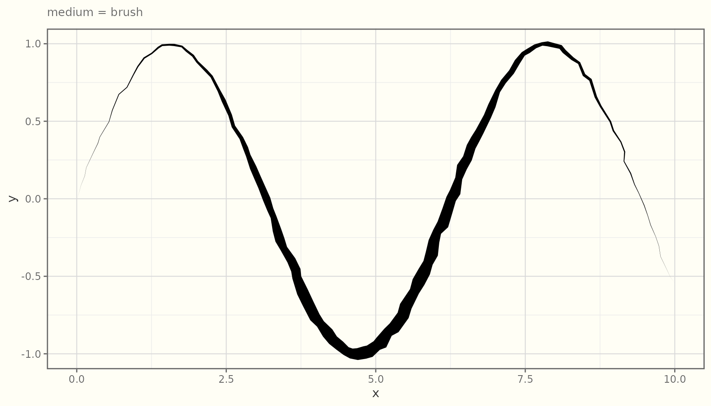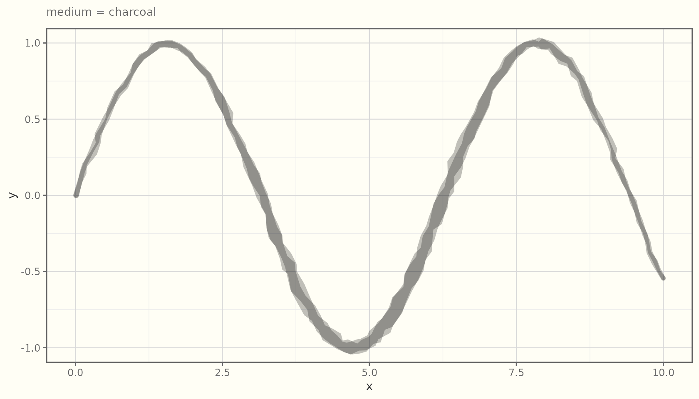

You can also *map* `medium` to a variable with
[`scale_medium_discrete()`](https://orijitghosh.github.io/ggsketch/reference/scale_medium_discrete.md)
(see the gallery). The default, `"pen"`, reproduces the classic
constant-width sketch line, so existing plots are unchanged.

## `seed` — reproducible wobble

The sketch is random, but **seeded**. A given `seed` always produces the
same drawing, so figures are reproducible across renders and devices.
Change the seed for a fresh “hand”.

``` r

d2 <- data.frame(x = 1:8, y = c(2, 5, 3, 8, 6, 9, 7, 10))
for (s in c(1, 1, 42)) {
  print(
    ggplot(d2, aes(x, y)) +
      geom_sketch_line(linewidth = 1, seed = s) +
      geom_sketch_point(size = 3, seed = s + 100) +
      labs(subtitle = paste("seed =", s)) +
      theme_sketch(base_size = 9)
  )
}
```

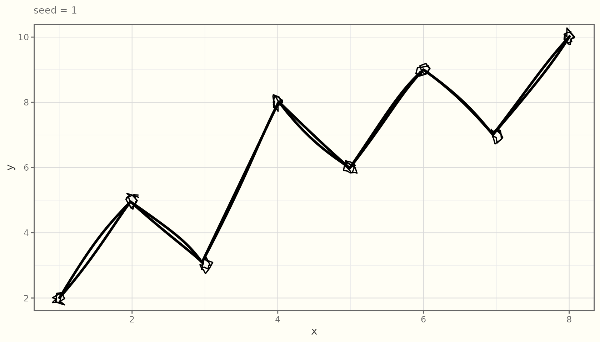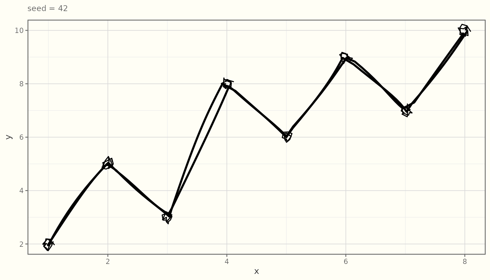

The first two panels are identical (same seed); the third differs.

### Session-wide default

If you do not pass `seed`, geoms use `getOption("ggsketch.seed", 1L)`.
Set it once to make a whole document reproducible:

``` r

options(ggsketch.seed = 1L)
```

ggsketch never touches your global random state: each randomized routine
draws from its own seeded stream and restores `.Random.seed` afterward,
so it will not interfere with
[`set.seed()`](https://rdrr.io/r/base/Random.html) elsewhere in your
analysis.
