# Gallery — every geom

Everything here is a real ggplot2 layer, so it composes with
[`aes()`](https://ggplot2.tidyverse.org/reference/aes.html), stats,
scales, facets, and coords — and renders on any device. Every example
sets a `seed` so the wobble is reproducible.

Every plot uses a handwriting font throughout via
`options(ggsketch.base_family = "auto")` in setup; without it,
[`theme_sketch()`](https://orijitghosh.github.io/ggsketch/reference/theme_sketch.md)
keeps the device default font and only the labels that geoms draw
themselves
([`geom_sketch_text()`](https://orijitghosh.github.io/ggsketch/reference/geom_sketch_text.md),
[`geom_sketch_bracket()`](https://orijitghosh.github.io/ggsketch/reference/geom_sketch_bracket.md))
are hand-drawn.

## Bars and columns

[`geom_sketch_col()`](https://orijitghosh.github.io/ggsketch/reference/geom_sketch_col.md)
draws a roughened outline with a hachure (pencil-shading) fill.

``` r

sales <- data.frame(product = c("Alpha", "Bravo", "Charlie", "Delta", "Echo"),
                    units   = c(34, 51, 22, 47, 39))

ggplot(sales, aes(product, units)) +
  geom_sketch_col(fill = "#7BAFD4", seed = 1L) +
  labs(title = "Units sold", x = NULL) +
  theme_sketch()
```

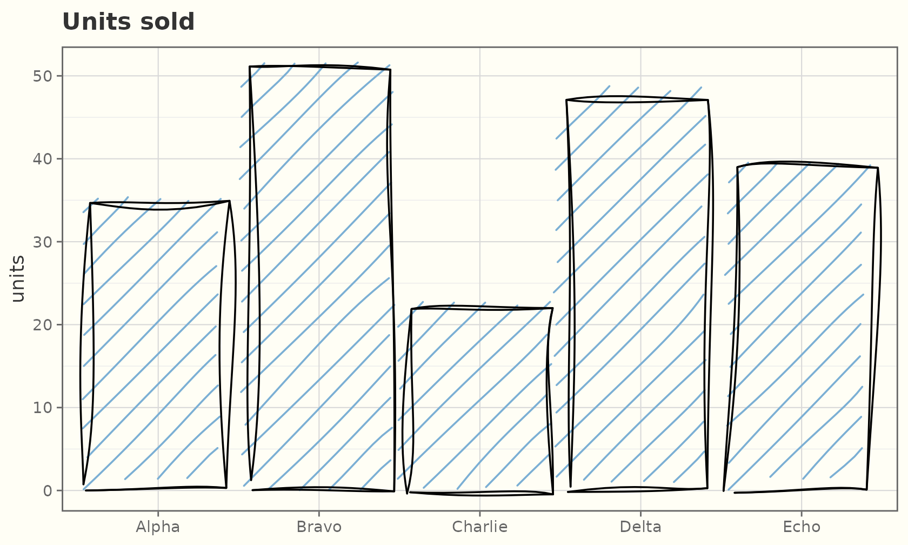

Map `fill` to a variable like any ggplot2 bar. Each bar gets its own
seed offset, so no two bars wobble identically.

``` r

ggplot(sales, aes(product, units, fill = product)) +
  geom_sketch_col(seed = 2L, show.legend = FALSE) +
  scale_fill_brewer(palette = "Set2") +
  labs(title = "Mapped fill", x = NULL) +
  theme_sketch()
```

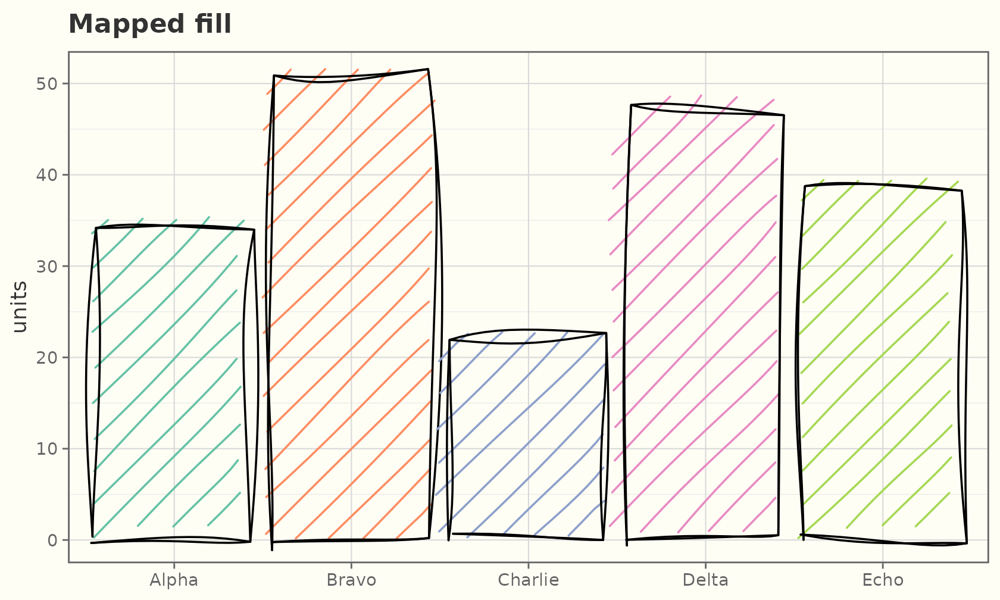

[`geom_sketch_bar()`](https://orijitghosh.github.io/ggsketch/reference/geom_sketch_col.md)
counts rows for you (like
[`geom_bar()`](https://ggplot2.tidyverse.org/reference/geom_bar.html)):

``` r

ggplot(mpg, aes(class)) +
  geom_sketch_bar(fill = "#C39BD3", seed = 3L) +
  labs(title = "Vehicle count by class", x = NULL) +
  theme_sketch() +
  theme(axis.text.x = element_text(angle = 30, hjust = 1))
```

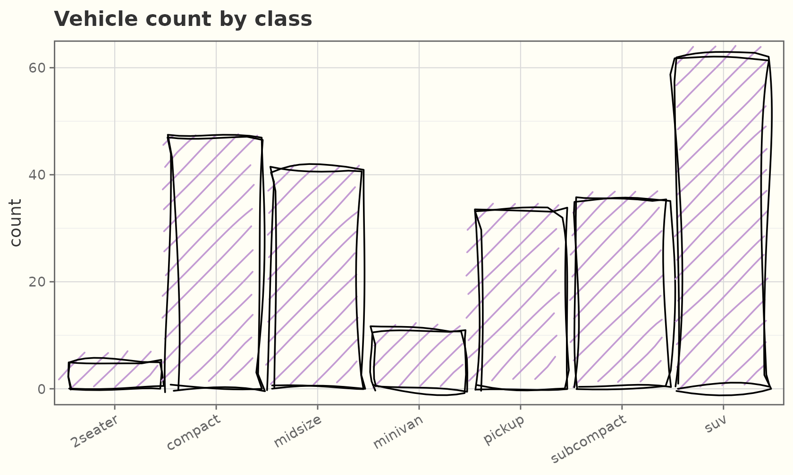

Bars flip and stack just like the originals:

``` r

ggplot(sales, aes(reorder(product, units), units)) +
  geom_sketch_col(fill = "#F1948A", seed = 1L) +
  coord_flip() +
  labs(title = "Horizontal bars", x = NULL) +
  theme_sketch()
```

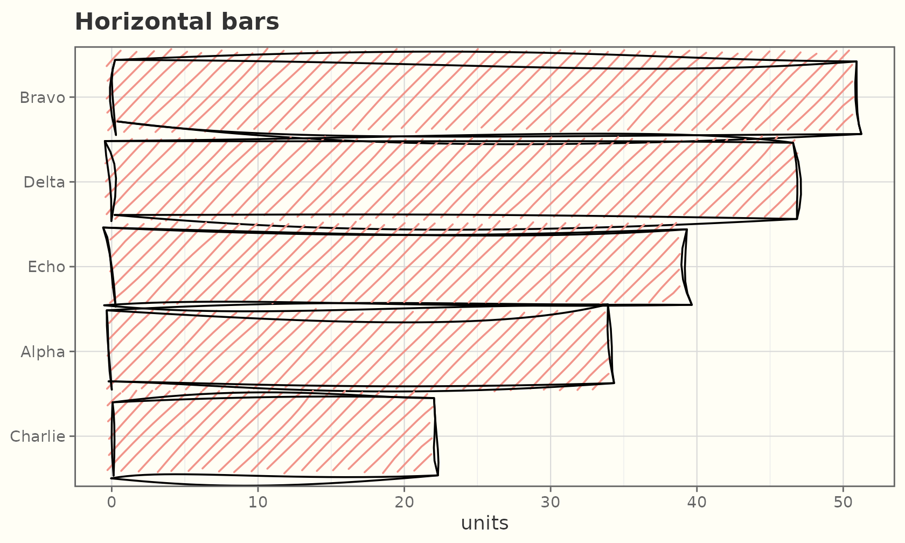

## Histograms and frequency polygons

[`geom_sketch_histogram()`](https://orijitghosh.github.io/ggsketch/reference/geom_sketch_histogram.md)
bins a continuous variable and draws hand-drawn bars;
[`geom_sketch_freqpoly()`](https://orijitghosh.github.io/ggsketch/reference/geom_sketch_histogram.md)
draws the same counts as a roughened line.

``` r

ggplot(faithful, aes(eruptions)) +
  geom_sketch_histogram(fill = "#7BAFD4", bins = 20, seed = 1L) +
  labs(title = "Old Faithful eruption times") +
  theme_sketch()
```

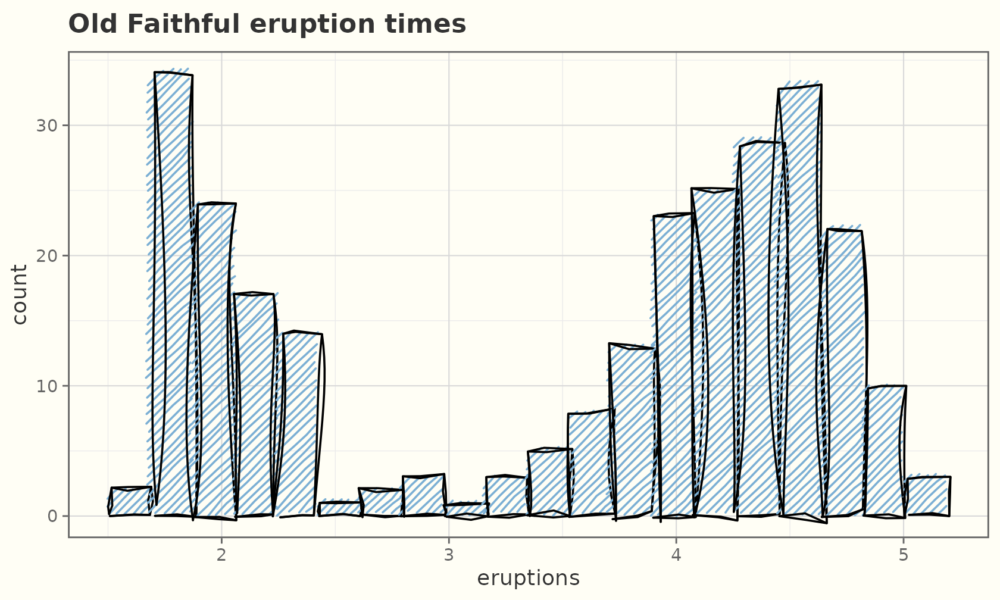

``` r

ggplot(mpg, aes(hwy, colour = drv)) +
  geom_sketch_freqpoly(bins = 15, linewidth = 0.9, seed = 2L) +
  labs(title = "Highway mpg by drivetrain", x = "hwy") +
  theme_sketch()
```

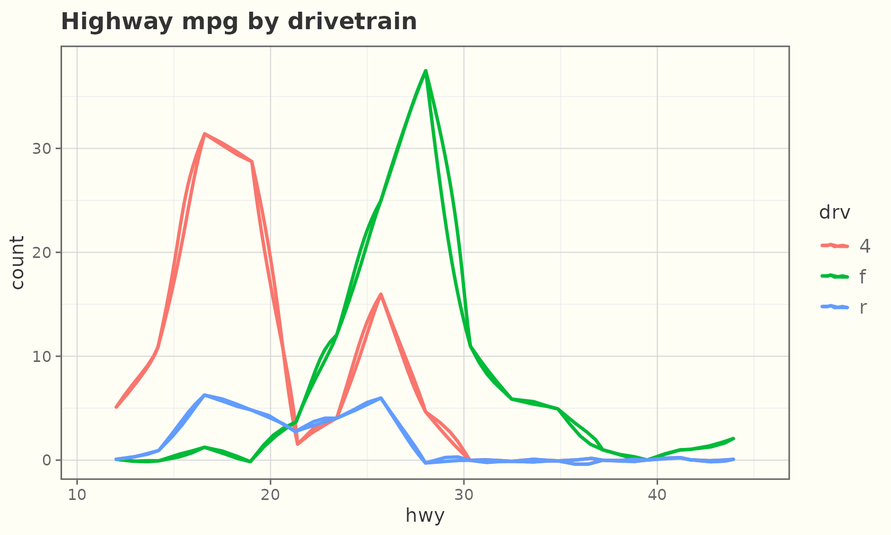

## Lines, paths, and points

``` r

econ <- economics[economics$date > as.Date("2000-01-01"), ]
ggplot(econ, aes(date, unemploy)) +
  geom_sketch_line(colour = "steelblue", linewidth = 0.8, seed = 1L) +
  labs(title = "US unemployment", x = NULL, y = "thousands") +
  theme_sketch()
```

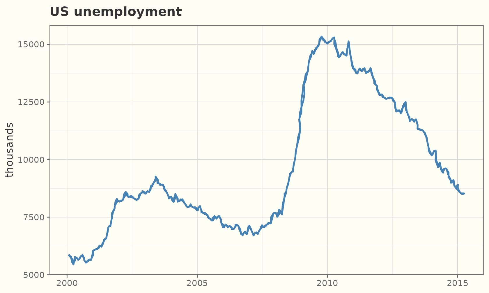

[`geom_sketch_point()`](https://orijitghosh.github.io/ggsketch/reference/geom_sketch_point.md)
draws each point as a small roughened ellipse:

``` r

ggplot(mtcars, aes(wt, mpg, colour = factor(cyl))) +
  geom_sketch_point(size = 4, seed = 1L) +
  scale_colour_brewer("cylinders", palette = "Dark2") +
  labs(title = "Fuel economy vs weight") +
  theme_sketch()
```

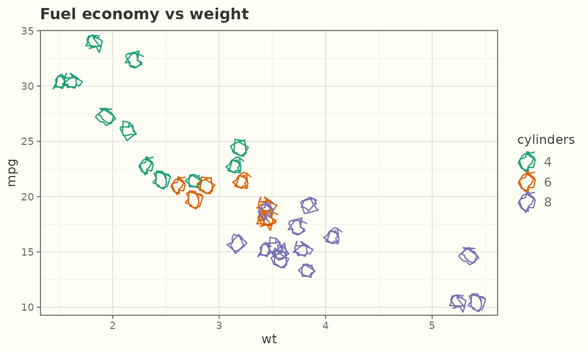

Lines and points compose like any layers:

``` r

df <- data.frame(x = 1:12, y = c(3, 5, 4, 7, 6, 9, 8, 11, 9, 12, 11, 14))
ggplot(df, aes(x, y)) +
  geom_sketch_line(colour = "grey40", seed = 3L) +
  geom_sketch_point(size = 4, colour = "firebrick", seed = 8L) +
  labs(title = "Trend with markers") +
  theme_sketch()
```

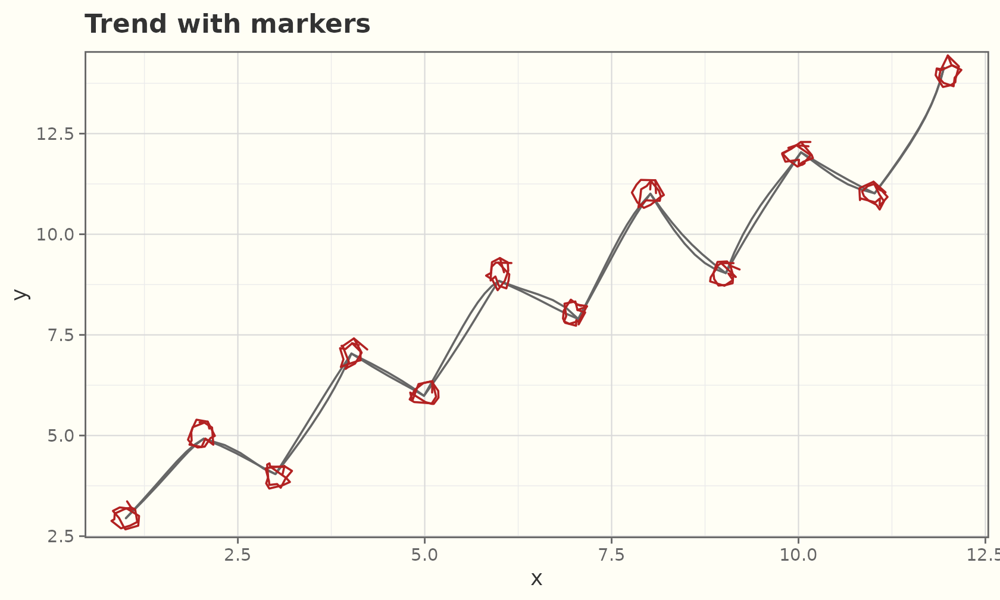

Multiple groups, one seed per group:

``` r

ggplot(ggplot2::economics_long, aes(date, value01, colour = variable)) +
  geom_sketch_line(seed = 5L) +
  labs(title = "Five series, hand-drawn", x = NULL, y = NULL) +
  theme_sketch()
```

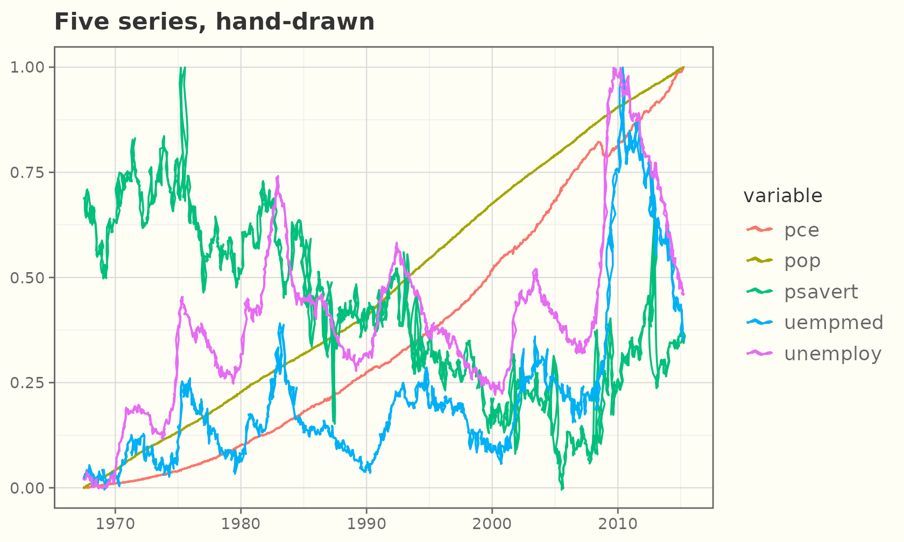

## Point sizes

`size` behaves like any ggplot2 point size. Set it to a constant for
bigger or smaller markers:

``` r

sz <- data.frame(x = 1:5, y = 1, s = c(2, 4, 6, 9, 13))
ggplot(sz, aes(x, y)) +
  geom_sketch_point(size = sz$s, colour = "#2E86C1", seed = 1L) +
  labs(title = "Fixed point sizes (2 → 13)", x = NULL, y = NULL) +
  theme_sketch()
```

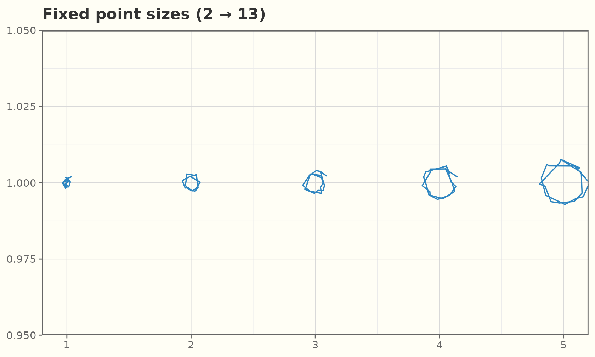

Or map `size` to a variable for a bubble chart — pair it with
[`scale_size_area()`](https://ggplot2.tidyverse.org/reference/scale_size.html)
so the *area* (not radius) encodes the value:

``` r

ggplot(mtcars, aes(wt, mpg, size = hp, colour = factor(cyl))) +
  geom_sketch_point(alpha = 0.9, seed = 2L) +
  scale_size_area("horsepower", max_size = 14) +
  scale_colour_brewer("cylinders", palette = "Dark2") +
  labs(title = "Bubble chart: size = horsepower") +
  theme_sketch()
```

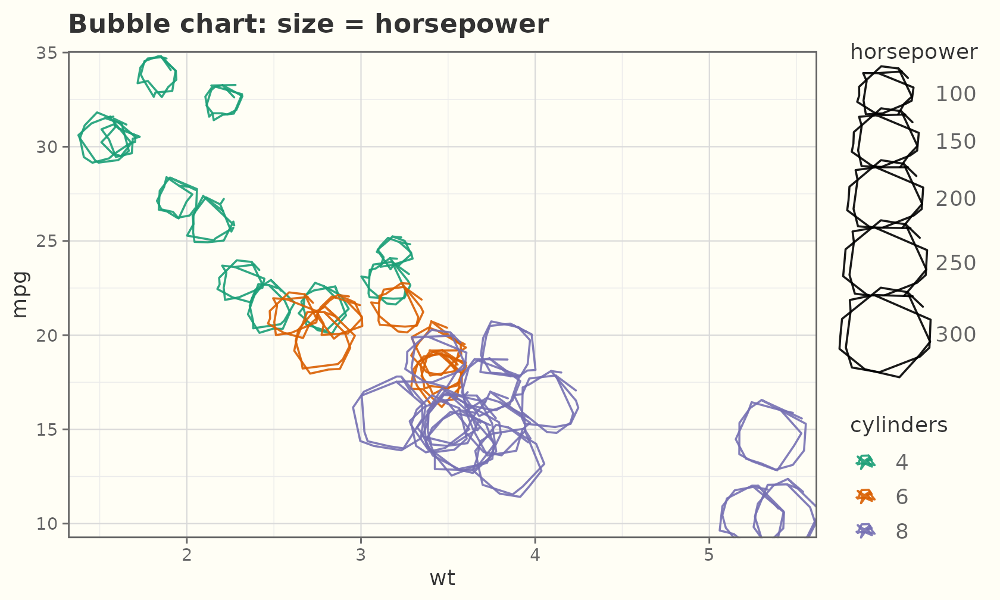

A small-multiples sweep of a single size aesthetic:

``` r

grid <- expand.grid(x = 1:6, y = 1:3)
grid$s <- seq(1.5, 11, length.out = nrow(grid))
ggplot(grid, aes(x, y, size = s)) +
  geom_sketch_point(colour = "#884EA0", show.legend = FALSE, seed = 3L) +
  scale_size_identity() +
  labs(title = "Increasing point size", x = NULL, y = NULL) +
  theme_sketch()
```

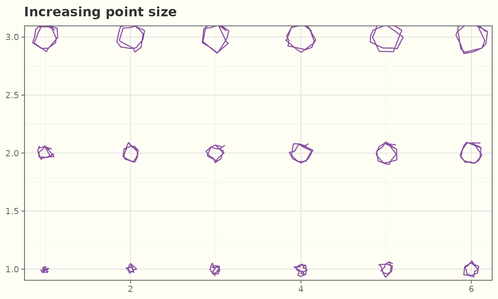

## Point roughness

For
[`geom_sketch_point()`](https://orijitghosh.github.io/ggsketch/reference/geom_sketch_point.md),
`roughness` is a *mappable aesthetic*. As a constant it sets how wobbly
every marker is — from clean circles up to very shaky:

``` r

rg <- data.frame(x = 1:4, y = 1, r = c(0, 0.4, 0.9, 1.6))
ggplot(rg, aes(x, y)) +
  geom_sketch_point(aes(roughness = I(r)), size = 14, colour = "#2E86C1",
                    seed = 1L) +
  geom_sketch_text(aes(label = r), nudge_y = -0.5, size = 6) +
  labs(title = "roughness 0 → 1.6 (constant per point)",
       x = NULL, y = NULL) +
  ylim(0.3, 1.3) +
  theme_sketch() +
  theme(axis.text = element_blank())
```

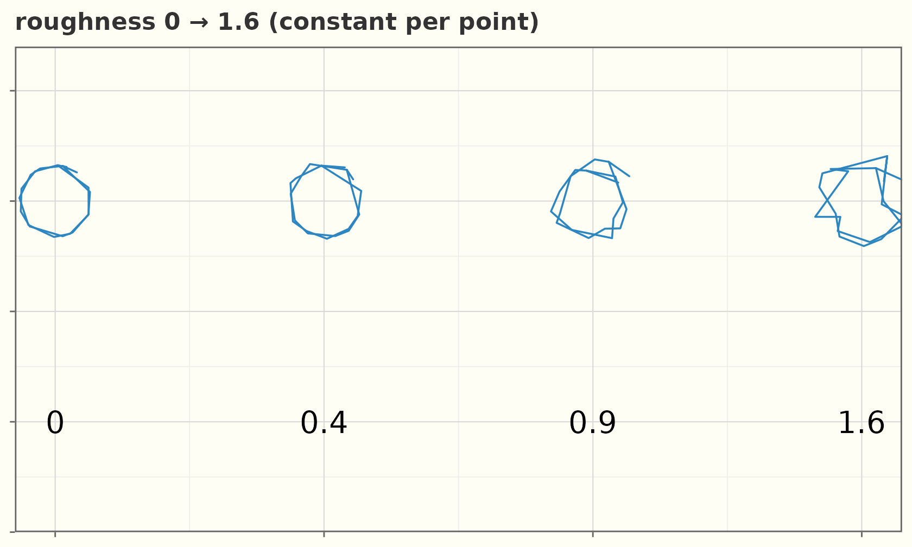

Map it to a variable and the values are rescaled to a legible band by
[`scale_roughness_continuous()`](https://orijitghosh.github.io/ggsketch/reference/scale_roughness_continuous.md)
(applied automatically, default `c(0.01, 0.75)`), so points can encode a
third variable through how shaky they look:

``` r

ggplot(mtcars, aes(wt, mpg, roughness = hp, colour = factor(cyl))) +
  geom_sketch_point(size = 4, seed = 1L) +
  scale_colour_brewer("cylinders", palette = "Dark2") +
  labs(title = "roughness mapped to horsepower") +
  theme_sketch()
```

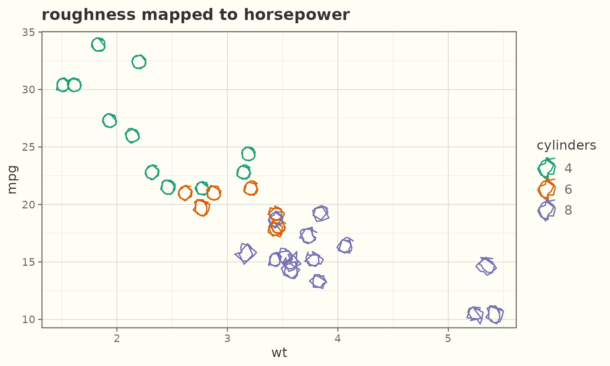

Use [`I()`](https://rdrr.io/r/base/AsIs.html) to pass raw roughness
through unscaled, or `scale_roughness_continuous(range = ...)` to widen
the band.

## Jitter and count

[`geom_sketch_jitter()`](https://orijitghosh.github.io/ggsketch/reference/geom_sketch_jitter.md)
spreads overplotted points;
[`geom_sketch_count()`](https://orijitghosh.github.io/ggsketch/reference/geom_sketch_count.md)
sizes a single point by how many observations sit there.

``` r

ggplot(mpg, aes(class, hwy)) +
  geom_sketch_jitter(width = 0.2, height = 0, colour = "#5D6D7E",
                     size = 2, seed = 1L) +
  labs(title = "Jittered highway mpg", x = NULL) +
  theme_sketch() +
  theme(axis.text.x = element_text(angle = 30, hjust = 1))
```

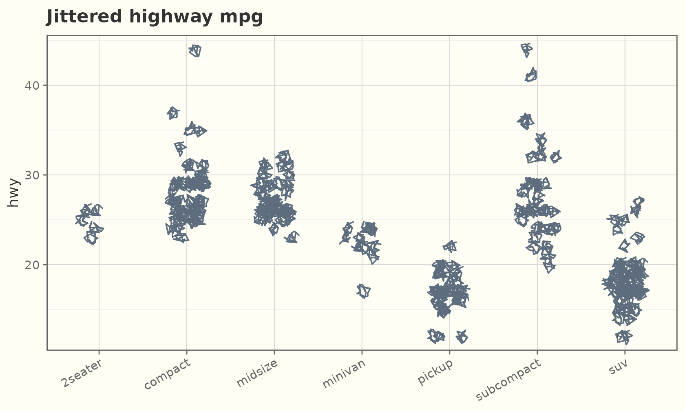

``` r

ggplot(mpg, aes(cty, hwy)) +
  geom_sketch_count(colour = "#C0392B", seed = 2L) +
  scale_size_area(max_size = 8) +
  labs(title = "Overplot count") +
  theme_sketch()
```

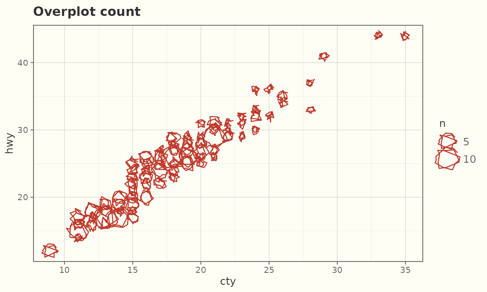

## Rectangles and tiles

``` r

rects <- data.frame(xmin = c(1, 3, 5), xmax = c(2, 4, 6),
                    ymin = 0, ymax = c(2, 4, 3))
ggplot(rects) +
  geom_sketch_rect(aes(xmin = xmin, xmax = xmax, ymin = ymin, ymax = ymax,
                       fill = factor(xmin)),
                   seed = 1L, show.legend = FALSE) +
  labs(title = "geom_sketch_rect()") +
  theme_sketch()
```

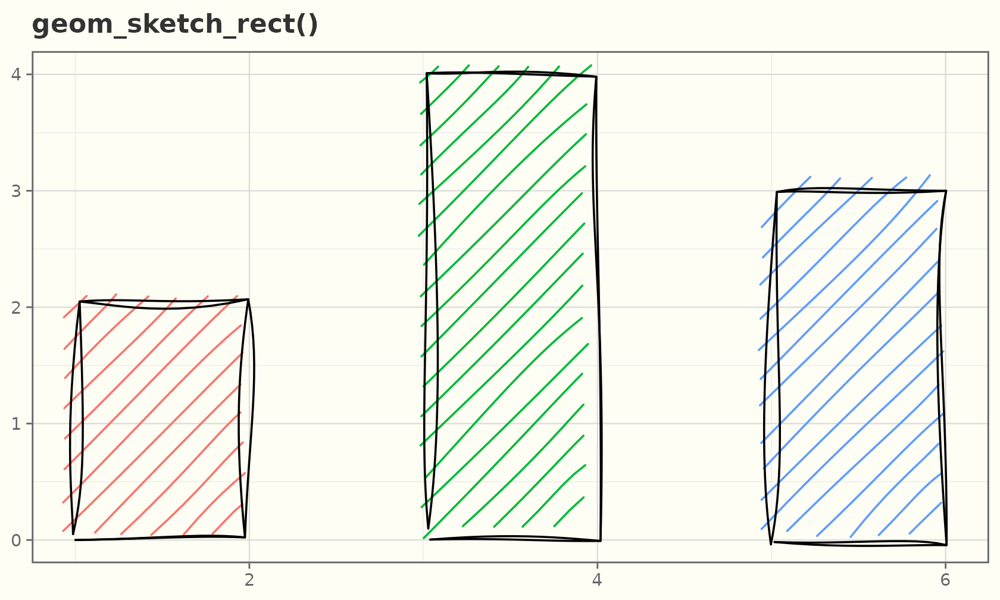

A sketchy heatmap with
[`geom_sketch_tile()`](https://orijitghosh.github.io/ggsketch/reference/geom_sketch_rect.md):

``` r

td <- expand.grid(x = 1:8, y = 1:6)
td$z <- td$x + td$y
ggplot(td, aes(x, y, fill = z)) +
  geom_sketch_tile(seed = 2L, hachure_gap = 0.18) +
  scale_fill_viridis_c() +
  labs(title = "geom_sketch_tile()") +
  theme_sketch()
```

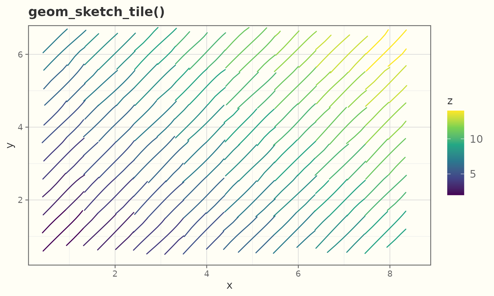

A sketchy 2-D bin heatmap with
[`geom_sketch_bin2d()`](https://orijitghosh.github.io/ggsketch/reference/geom_sketch_bin2d.md)
(cells default to a hachure fill, shaded by count):

``` r

ggplot(faithful, aes(eruptions, waiting)) +
  geom_sketch_bin2d(bins = 12, seed = 3L) +
  scale_fill_viridis_c() +
  labs(title = "geom_sketch_bin2d()") +
  theme_sketch()
```

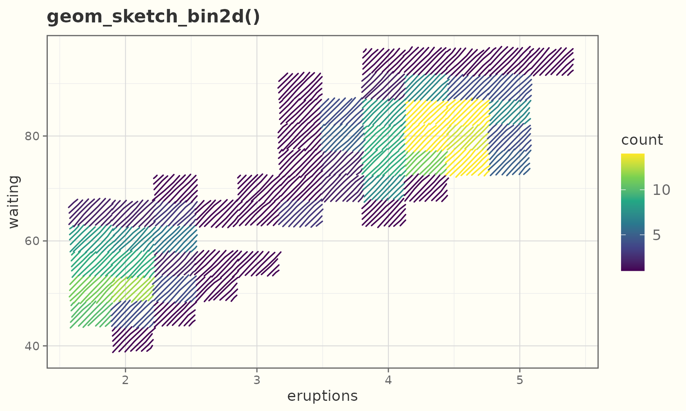

[`geom_sketch_hex()`](https://orijitghosh.github.io/ggsketch/reference/geom_sketch_hex.md)
bins into hexagons instead (needs the **hexbin** package):

``` r

ggplot(faithful, aes(eruptions, waiting)) +
  geom_sketch_hex(bins = 12, seed = 4L) +
  scale_fill_viridis_c(option = "magma") +
  labs(title = "geom_sketch_hex()") +
  theme_sketch()
```

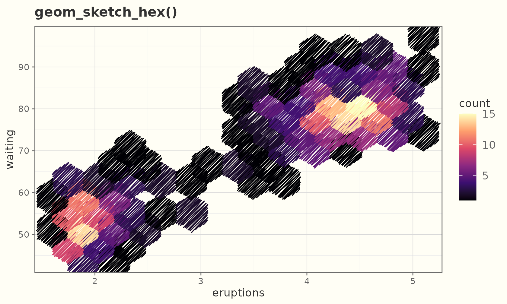

## Polygons, ribbons, areas, and densities

Concave polygons fill correctly (the hachure respects every notch):

``` r

ang  <- seq(0, 2 * pi, length.out = 11)[-11]
r    <- rep(c(1, 0.45), length.out = 10)
star <- data.frame(x = r * cos(ang), y = r * sin(ang))
ggplot(star, aes(x, y)) +
  geom_sketch_polygon(fill = "tomato", seed = 1L) +
  coord_equal() +
  labs(title = "A concave star") +
  theme_sketch()
```

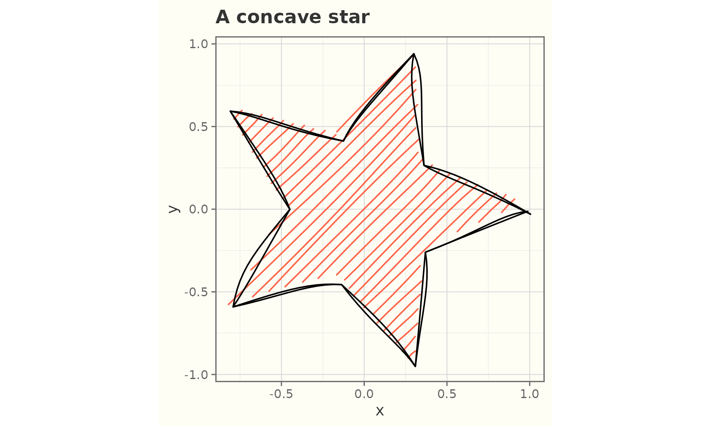

``` r

band <- data.frame(x = 1:20)
band$y  <- 10 + 5 * sin(seq(0, 3 * pi, length.out = 20))
band$lo <- band$y - 2
band$hi <- band$y + 2

ggplot(band, aes(x)) +
  geom_sketch_ribbon(aes(ymin = lo, ymax = hi), fill = "plum", seed = 2L) +
  geom_sketch_line(aes(y = y), seed = 3L) +
  labs(title = "Ribbon + line") +
  theme_sketch()
```

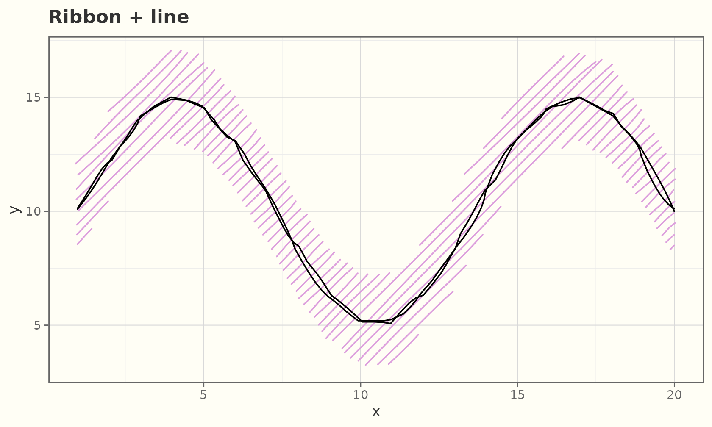

``` r

ggplot(band, aes(x, y)) +
  geom_sketch_area(fill = "lightgreen", seed = 3L) +
  labs(title = "geom_sketch_area()") +
  theme_sketch()
```

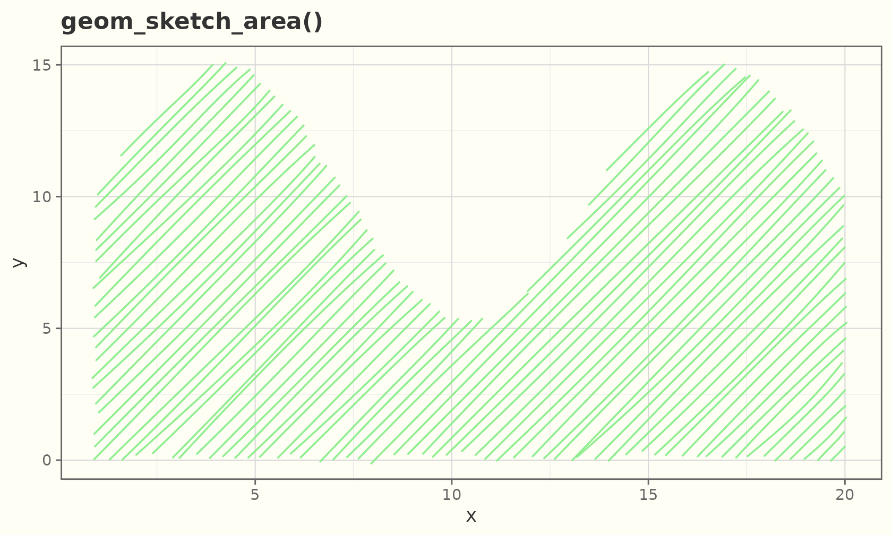

``` r

ggplot(faithful, aes(eruptions)) +
  geom_sketch_density(fill = "khaki", seed = 4L) +
  labs(title = "Old Faithful eruptions") +
  theme_sketch()
```

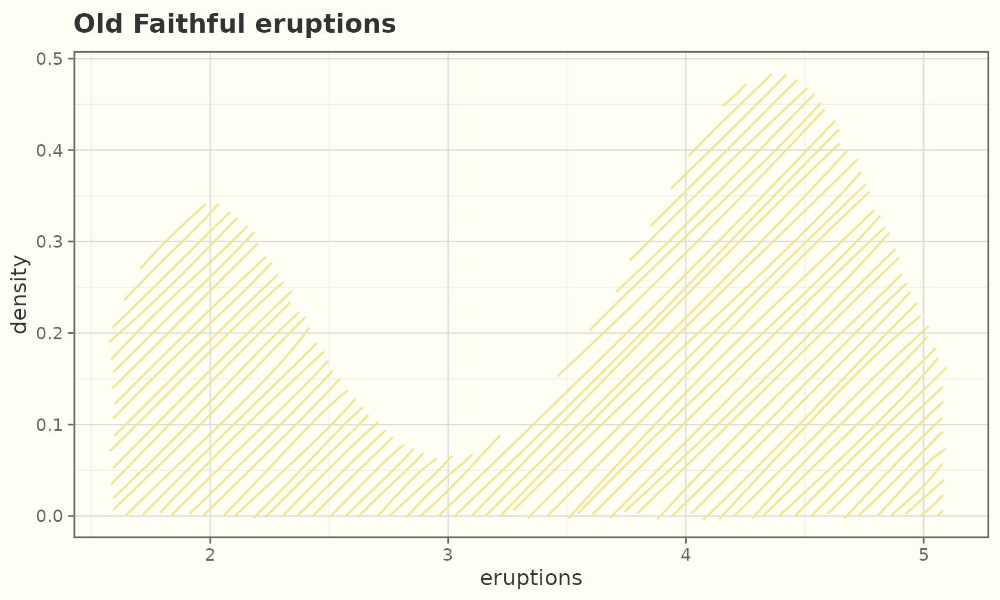

## Violins

[`geom_sketch_violin()`](https://orijitghosh.github.io/ggsketch/reference/geom_sketch_violin.md)
mirrors a kernel density into a closed polygon and hachure-fills it.

``` r

ggplot(mpg, aes(class, hwy, fill = class)) +
  geom_sketch_violin(seed = 1L, show.legend = FALSE) +
  scale_fill_brewer(palette = "Set3") +
  labs(title = "Highway mpg distribution by class", x = NULL) +
  theme_sketch() +
  theme(axis.text.x = element_text(angle = 30, hjust = 1))
```

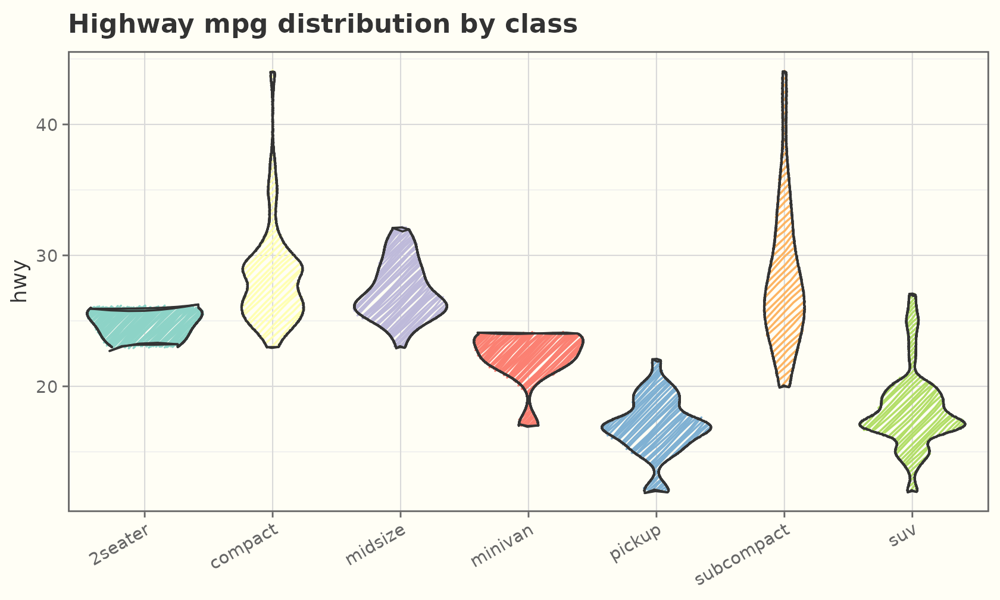

## Smooths

A hand-drawn fit with a roughened confidence band:

``` r

ggplot(mtcars, aes(wt, mpg)) +
  geom_sketch_point(seed = 1L) +
  geom_sketch_smooth(method = "lm", formula = y ~ x, seed = 2L) +
  labs(title = "Linear fit with CI band") +
  theme_sketch()
```

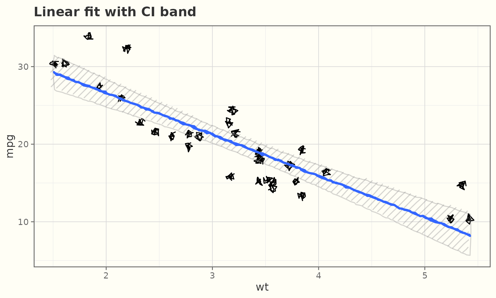

``` r

ggplot(mpg, aes(displ, hwy)) +
  geom_sketch_point(colour = "grey50", seed = 1L) +
  geom_sketch_smooth(seed = 2L, colour = "darkorange") +
  labs(title = "loess fit") +
  theme_sketch()
```

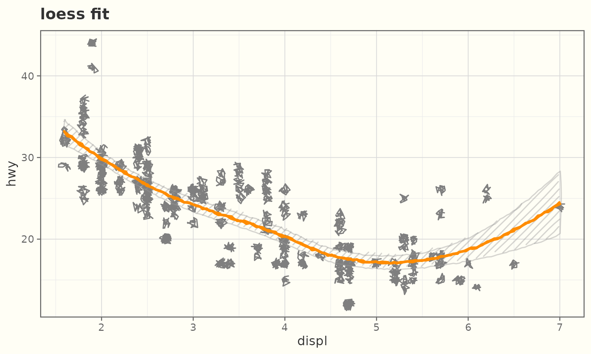

## Function curves

[`geom_sketch_function()`](https://orijitghosh.github.io/ggsketch/reference/geom_sketch_function.md)
sketches an analytic curve over the x range, for example to overlay a
theoretical density.

``` r

ggplot(data.frame(x = c(-4, 4)), aes(x)) +
  geom_sketch_function(fun = dnorm, colour = "#2E86C1", linewidth = 0.9,
                       seed = 1L) +
  geom_sketch_function(fun = dnorm, args = list(sd = 1.6),
                       colour = "#C0392B", linewidth = 0.9, seed = 2L) +
  labs(title = "Two normal densities", y = "density") +
  theme_sketch()
```

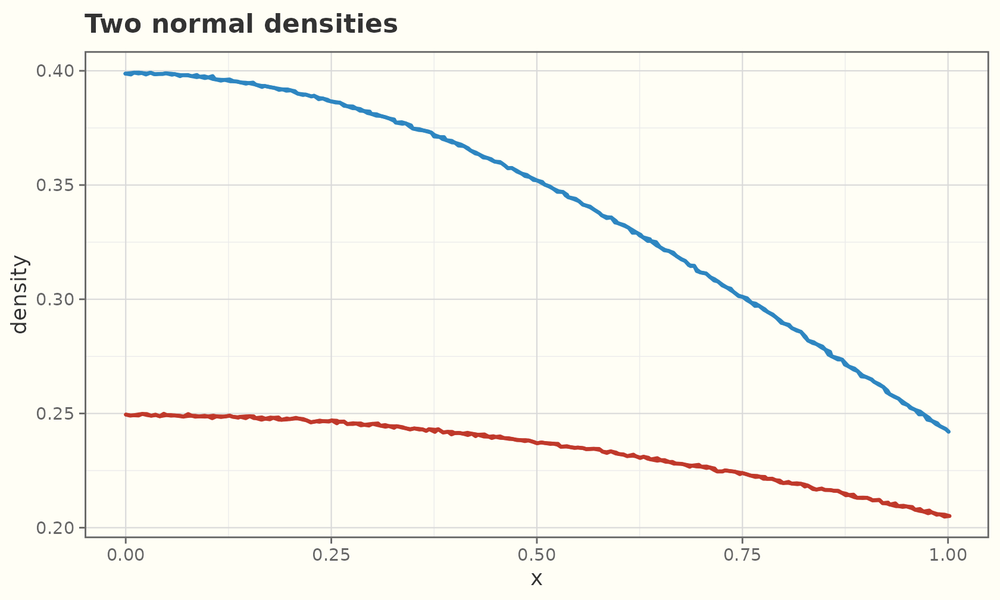

## Q-Q plots

[`geom_sketch_qq()`](https://orijitghosh.github.io/ggsketch/reference/geom_sketch_qq.md)
draws the quantile-quantile points and
[`geom_sketch_qq_line()`](https://orijitghosh.github.io/ggsketch/reference/geom_sketch_qq.md)
the reference line. Map data to the `sample` aesthetic.

``` r

ggplot(mtcars, aes(sample = mpg)) +
  geom_sketch_qq(size = 2.5, seed = 1L) +
  geom_sketch_qq_line(colour = "#C8553D", linewidth = 0.8, seed = 2L) +
  labs(title = "Normal Q-Q plot of mpg", x = "theoretical", y = "sample") +
  theme_sketch()
```

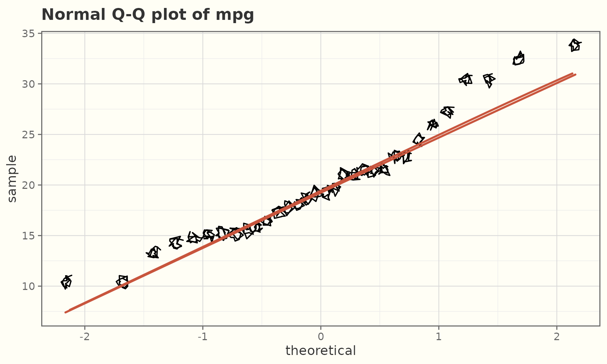

## Quantile regression

[`geom_sketch_quantile()`](https://orijitghosh.github.io/ggsketch/reference/geom_sketch_quantile.md)
fits and draws quantile regression lines (requires the optional
**quantreg** package).

``` r

ggplot(mpg, aes(displ, hwy)) +
  geom_sketch_point(colour = "grey60", seed = 1L) +
  geom_sketch_quantile(quantiles = c(0.1, 0.5, 0.9), colour = "#6C3483",
                       linewidth = 0.9, seed = 2L) +
  labs(title = "10th / 50th / 90th percentile fits") +
  theme_sketch()
```

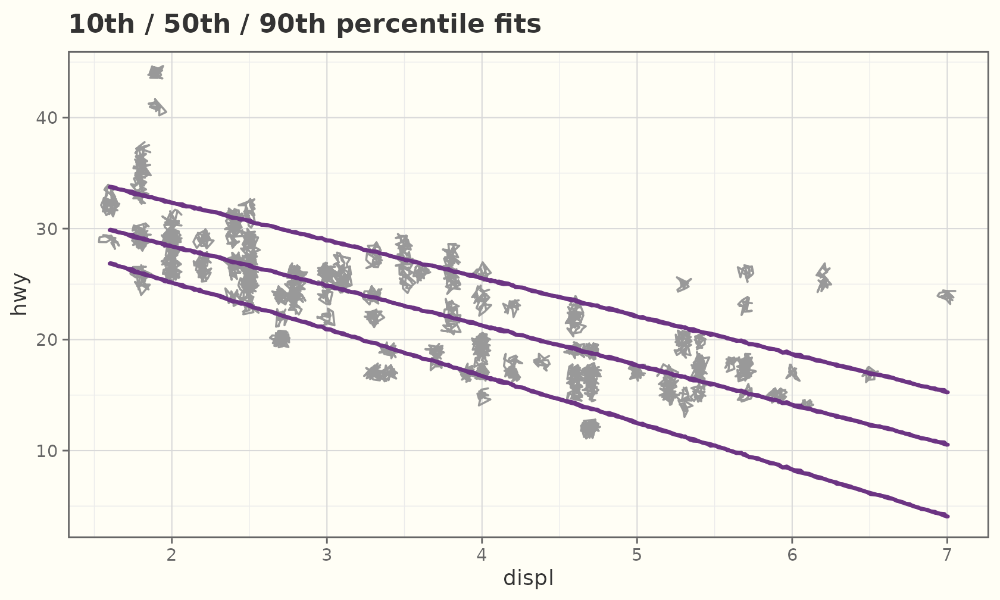

## Circles and ellipses

Radii are in data units, so use
[`coord_equal()`](https://ggplot2.tidyverse.org/reference/coord_fixed.html)
for true circles:

``` r

cdf <- data.frame(x = c(1, 3, 2), y = c(1, 1, 2.5),
                  r = c(0.6, 0.9, 0.5), grp = c("a", "b", "c"))
ggplot(cdf, aes(x, y, r = r, fill = grp)) +
  geom_sketch_circle(seed = 1L, show.legend = FALSE) +
  coord_equal() +
  labs(title = "geom_sketch_circle()") +
  theme_sketch()
```

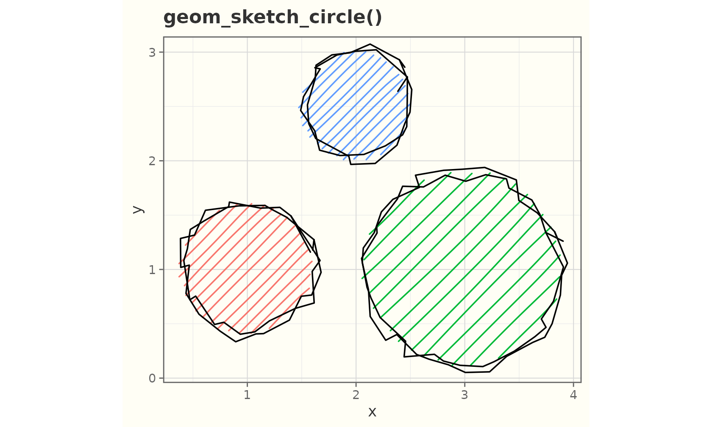

``` r

edf <- data.frame(x = c(1, 3), y = c(1, 2), a = c(1.4, 0.8), b = c(0.6, 1.2))
ggplot(edf, aes(x, y, a = a, b = b, fill = factor(x))) +
  geom_sketch_ellipse(seed = 2L, show.legend = FALSE) +
  coord_equal() +
  labs(title = "geom_sketch_ellipse()") +
  theme_sketch()
```

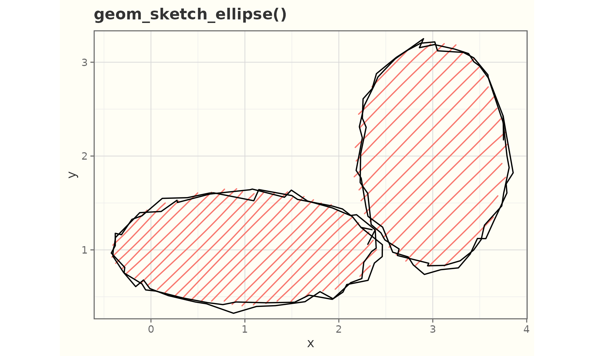

## Segments and steps

``` r

sdf <- data.frame(x = 1:4, y = c(1, 3, 2, 4),
                  xend = 2:5, yend = c(3, 1, 4, 2))
ggplot(sdf) +
  geom_sketch_segment(aes(x = x, y = y, xend = xend, yend = yend),
                      colour = "darkgreen", linewidth = 1, seed = 3L) +
  labs(title = "geom_sketch_segment()") +
  theme_sketch()
```

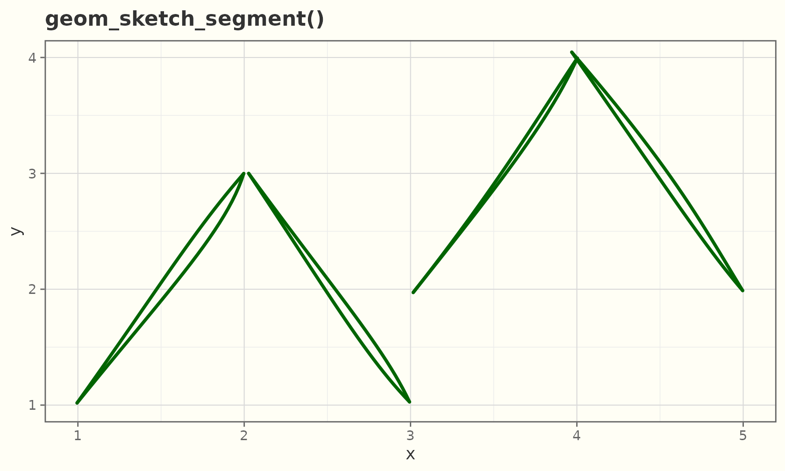

``` r

stp <- data.frame(x = 1:8, y = c(1, 3, 2, 5, 4, 6, 5, 8))
ggplot(stp, aes(x, y)) +
  geom_sketch_step(colour = "purple", linewidth = 1, seed = 4L) +
  geom_sketch_point(seed = 5L) +
  labs(title = "geom_sketch_step()") +
  theme_sketch()
```

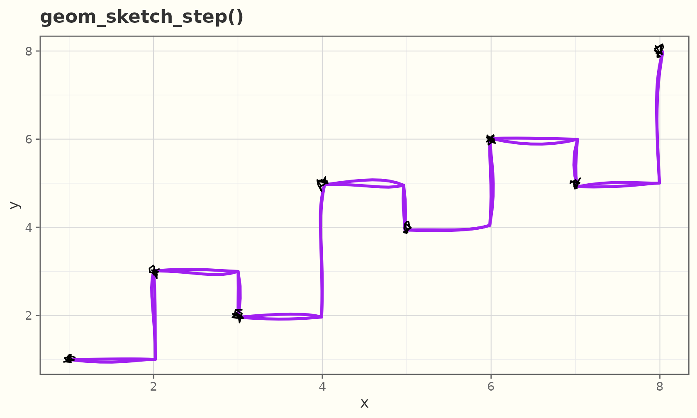

## Curves and spokes

[`geom_sketch_curve()`](https://orijitghosh.github.io/ggsketch/reference/geom_sketch_curve.md)
is a curved connector (a quadratic Bézier); `curvature` sets how much it
bends.

``` r

cdf <- data.frame(x = c(1, 1, 1), y = c(1, 2, 3),
                  xend = c(4, 4, 4), yend = c(1, 2, 3))
ggplot(cdf, aes(x, y)) +
  geom_sketch_curve(aes(xend = xend, yend = yend), curvature = 0.4,
                    colour = "#1A5276", linewidth = 0.9, seed = 1L) +
  geom_sketch_point(seed = 2L) +
  geom_sketch_point(aes(x = xend, y = yend), seed = 3L) +
  labs(title = "geom_sketch_curve()") +
  theme_sketch()
```

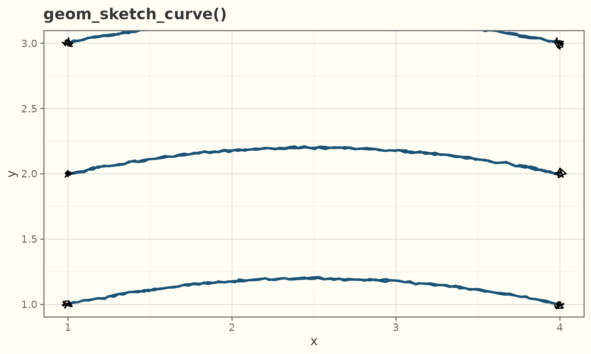

[`geom_sketch_spoke()`](https://orijitghosh.github.io/ggsketch/reference/geom_sketch_spoke.md)
draws a segment from each point by `angle` and `radius` — useful for
vector fields.

``` r

field <- expand.grid(x = 1:6, y = 1:6)
field$angle  <- with(field, atan2(y - 3.5, x - 3.5))
field$radius <- 0.6
ggplot(field, aes(x, y)) +
  geom_sketch_spoke(aes(angle = angle, radius = radius),
                    colour = "#117A65", seed = 1L) +
  geom_sketch_point(size = 1.5, seed = 2L) +
  coord_equal() +
  labs(title = "geom_sketch_spoke()") +
  theme_sketch()
```

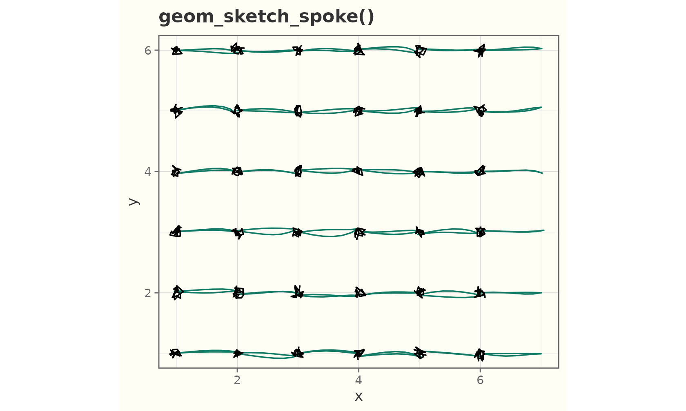

## Rugs

[`geom_sketch_rug()`](https://orijitghosh.github.io/ggsketch/reference/geom_sketch_rug.md)
adds marginal ticks along the panel edges (`sides`).

``` r

ggplot(mtcars, aes(wt, mpg)) +
  geom_sketch_point(colour = "#2C3E50", seed = 1L) +
  geom_sketch_rug(sides = "bl", colour = "#7B241C", seed = 2L) +
  labs(title = "Scatter with marginal rug") +
  theme_sketch()
```

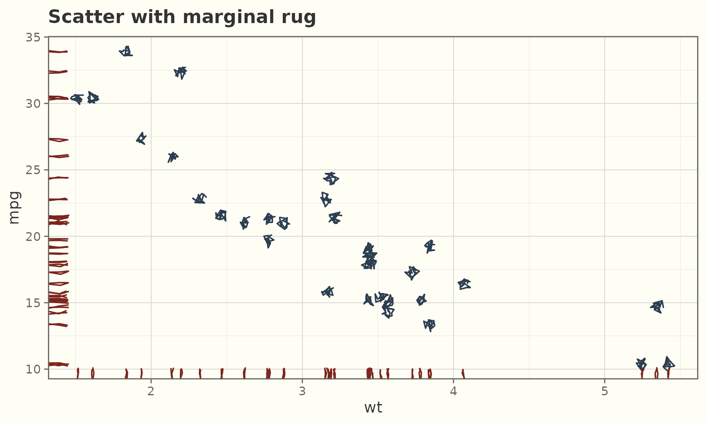

## Intervals and uncertainty

The interval family draws hand-drawn ranges:
[`geom_sketch_linerange()`](https://orijitghosh.github.io/ggsketch/reference/geom_sketch_linerange.md),
[`geom_sketch_pointrange()`](https://orijitghosh.github.io/ggsketch/reference/geom_sketch_linerange.md),
[`geom_sketch_errorbar()`](https://orijitghosh.github.io/ggsketch/reference/geom_sketch_linerange.md),
and
[`geom_sketch_crossbar()`](https://orijitghosh.github.io/ggsketch/reference/geom_sketch_linerange.md).

``` r

est <- data.frame(
  group = c("A", "B", "C", "D"),
  mean  = c(4.1, 5.6, 3.2, 6.0),
  lo    = c(3.2, 4.9, 2.4, 5.1),
  hi    = c(5.0, 6.4, 4.1, 6.8)
)
ggplot(est, aes(group, mean)) +
  geom_sketch_pointrange(aes(ymin = lo, ymax = hi), colour = "#1F618D",
                         seed = 1L) +
  labs(title = "Point estimates with 95% intervals", x = NULL) +
  theme_sketch()
```

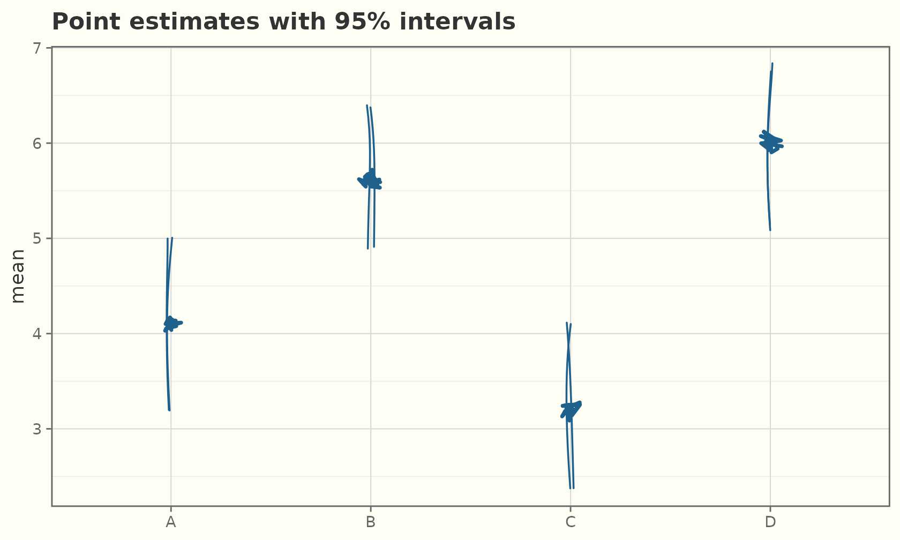

``` r

ggplot(est, aes(group, mean)) +
  geom_sketch_col(fill = "#AED6F1", width = 0.6, seed = 1L) +
  geom_sketch_errorbar(aes(ymin = lo, ymax = hi), width = 0.3, seed = 2L) +
  labs(title = "Bars with error bars", x = NULL) +
  theme_sketch()
```

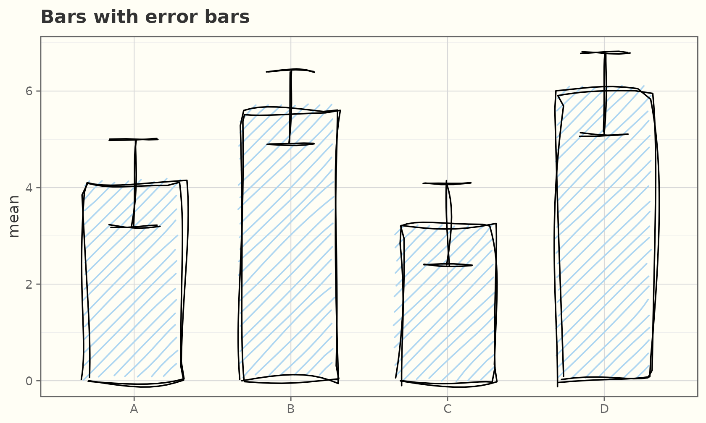

``` r

ggplot(est, aes(group, mean)) +
  geom_sketch_crossbar(aes(ymin = lo, ymax = hi), fill = "#FCF3CF",
                       fill_style = "hachure", seed = 3L) +
  labs(title = "geom_sketch_crossbar()", x = NULL) +
  theme_sketch()
```

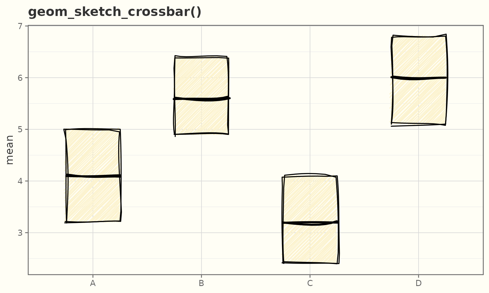

## Reference lines

[`geom_sketch_abline()`](https://orijitghosh.github.io/ggsketch/reference/geom_sketch_abline.md),
[`geom_sketch_hline()`](https://orijitghosh.github.io/ggsketch/reference/geom_sketch_abline.md),
and
[`geom_sketch_vline()`](https://orijitghosh.github.io/ggsketch/reference/geom_sketch_abline.md)
span the panel with a gentle wobble.

``` r

ggplot(mtcars, aes(wt, mpg)) +
  geom_sketch_point(seed = 1L) +
  geom_sketch_hline(yintercept = 20, colour = "#C0392B", seed = 2L) +
  geom_sketch_vline(xintercept = 3.3, colour = "#2471A3", seed = 3L) +
  geom_sketch_abline(slope = -5, intercept = 37, colour = "#117864",
                     linetype = 2, seed = 4L) +
  labs(title = "Reference lines") +
  theme_sketch()
```

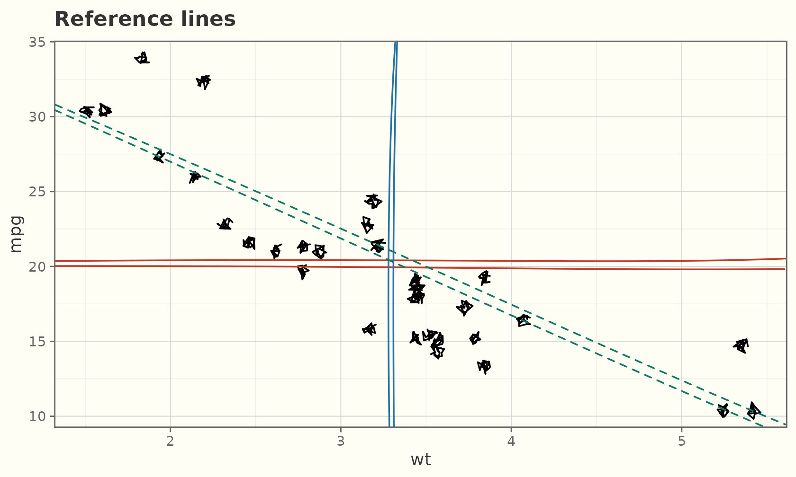

## Contours and 2-D density

[`geom_sketch_contour()`](https://orijitghosh.github.io/ggsketch/reference/geom_sketch_contour.md)
draws contour lines of a surface (needs `z`);
[`geom_sketch_density2d()`](https://orijitghosh.github.io/ggsketch/reference/geom_sketch_density2d.md)
contours a 2-D kernel density estimate.

``` r

ggplot(faithfuld, aes(waiting, eruptions, z = density)) +
  geom_sketch_contour(colour = "#2E4053", seed = 1L) +
  labs(title = "geom_sketch_contour()") +
  theme_sketch()
```

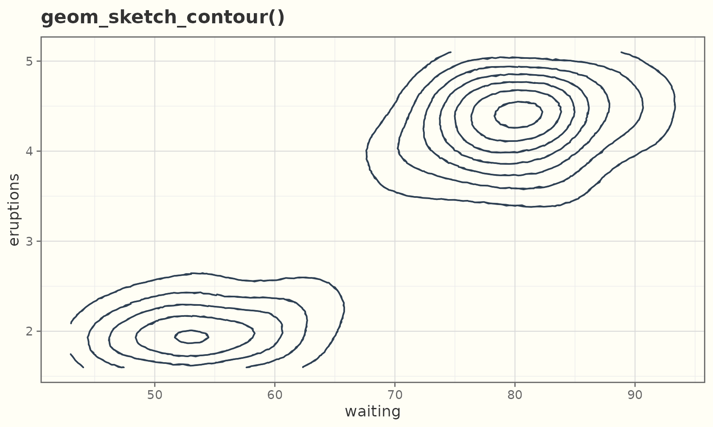

``` r

ggplot(faithful, aes(eruptions, waiting)) +
  geom_sketch_point(colour = "grey70", seed = 1L) +
  geom_sketch_density2d(colour = "#884EA0", linewidth = 0.7, seed = 2L) +
  labs(title = "geom_sketch_density2d()") +
  theme_sketch()
```

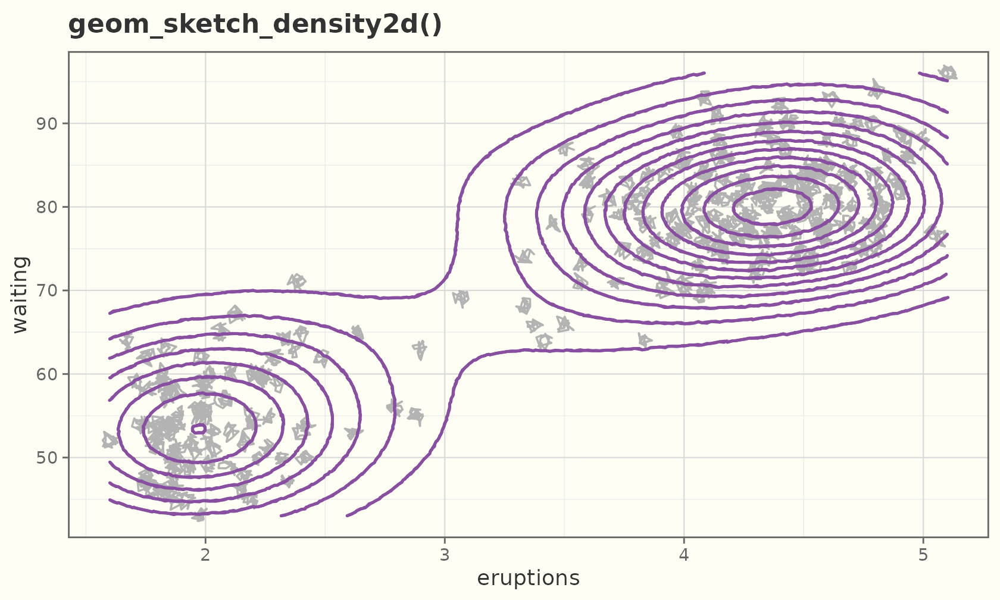

## Text

The sketch of text is a *handwriting font*, not roughened glyphs.
[`geom_sketch_text()`](https://orijitghosh.github.io/ggsketch/reference/geom_sketch_text.md)
uses the first installed handwriting face (and falls back to the device
default otherwise).

``` r

lab <- data.frame(x = c(2, 4, 3), y = c(3, 4, 1.5),
                  txt = c("hand", "drawn", "labels"))
ggplot(lab, aes(x, y, label = txt)) +
  geom_sketch_point(size = 3, colour = "#C0392B") +
  geom_sketch_text(size = 7, nudge_y = 0.4) +
  labs(title = "geom_sketch_text()") +
  theme_sketch()
```

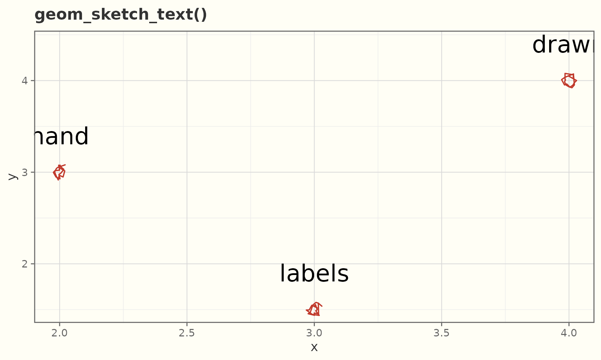

## Boxplots

A composed geom: rough IQR box, thick median, whiskers, and sketchy
outliers.

``` r

ggplot(mpg, aes(class, hwy)) +
  geom_sketch_boxplot(seed = 1L) +
  labs(title = "Highway mpg by class", x = NULL) +
  theme_sketch() +
  theme(axis.text.x = element_text(angle = 30, hjust = 1))
```

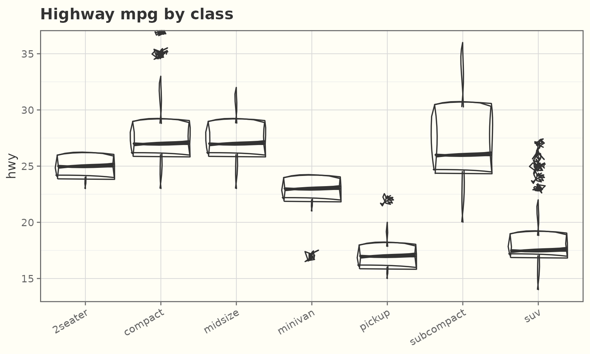

By default the box is outline-only (its `fill` is `NA`). Give it a
`fill` for a solid box, or map `fill` and switch on a fill style for
coloured, shaded boxes:

``` r

ggplot(mpg, aes(class, hwy, fill = class)) +
  geom_sketch_boxplot(fill_style = "hachure", seed = 1L, show.legend = FALSE) +
  scale_fill_brewer(palette = "Pastel1") +
  labs(title = "Hachure-filled boxes", x = NULL) +
  theme_sketch() +
  theme(axis.text.x = element_text(angle = 30, hjust = 1))
```

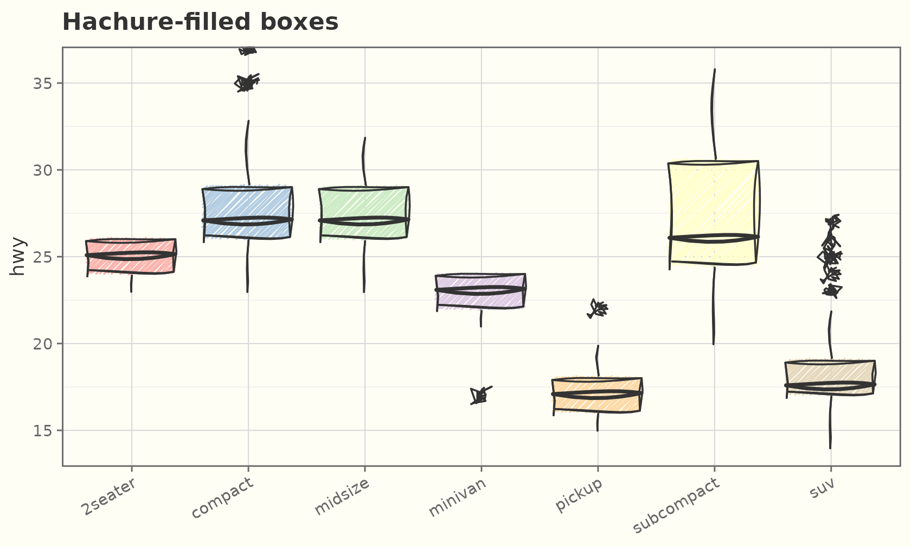

## Annotations

[`annotate_sketch()`](https://orijitghosh.github.io/ggsketch/reference/annotate_sketch.md)
adds one-off hand-drawn marks (no
[`aes()`](https://ggplot2.tidyverse.org/reference/aes.html)
inheritance):

``` r

ggplot(mtcars, aes(wt, mpg)) +
  geom_sketch_point(seed = 1L) +
  annotate_sketch("rect", xmin = 3, xmax = 4, ymin = 15, ymax = 22,
                  fill = NA, colour = "red", seed = 2L) +
  annotate_sketch("segment", x = 2, y = 32, xend = 3.4, yend = 21,
                  colour = "blue", linewidth = 1, seed = 3L) +
  annotate_sketch("circle", x = 5, y = 30, r = 0.4,
                  colour = "darkgreen", fill = "green", seed = 4L) +
  labs(title = "Highlighting with annotate_sketch()") +
  theme_sketch()
```

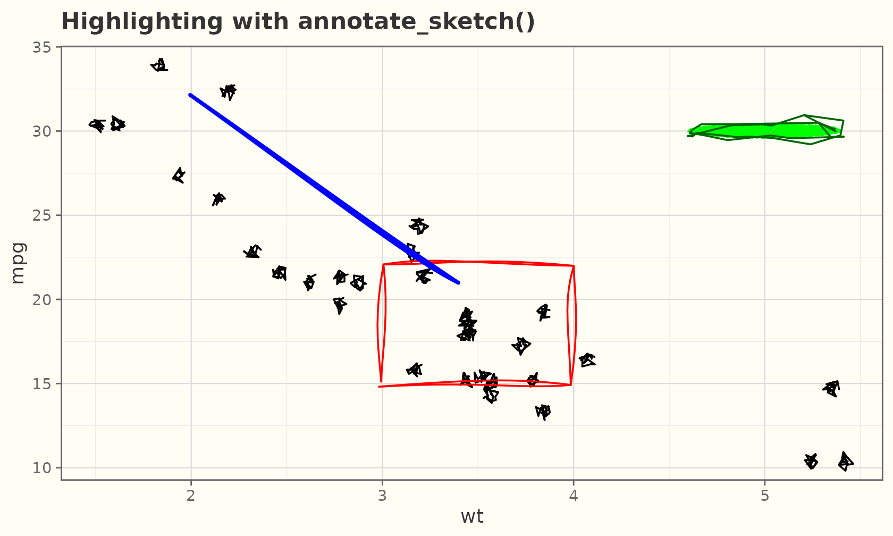

## Significance brackets

[`geom_sketch_bracket()`](https://orijitghosh.github.io/ggsketch/reference/geom_sketch_bracket.md)
draws a hand-drawn comparison bracket with an optional handwriting
label, for marking pairwise comparisons (a sketchy `ggsignif`).

``` r

brackets <- data.frame(
  xmin  = c(1, 2),
  xmax  = c(2, 3),
  y     = c(40, 45),
  label = c("p = 0.03", "n.s.")
)
ggplot(mpg, aes(drv, hwy)) +
  geom_sketch_boxplot(seed = 1L) +
  geom_sketch_bracket(
    data = brackets,
    aes(xmin = xmin, xmax = xmax, y = y, label = label),
    seed = 2L
  ) +
  labs(title = "Pairwise comparisons", x = "drivetrain") +
  theme_sketch()
```

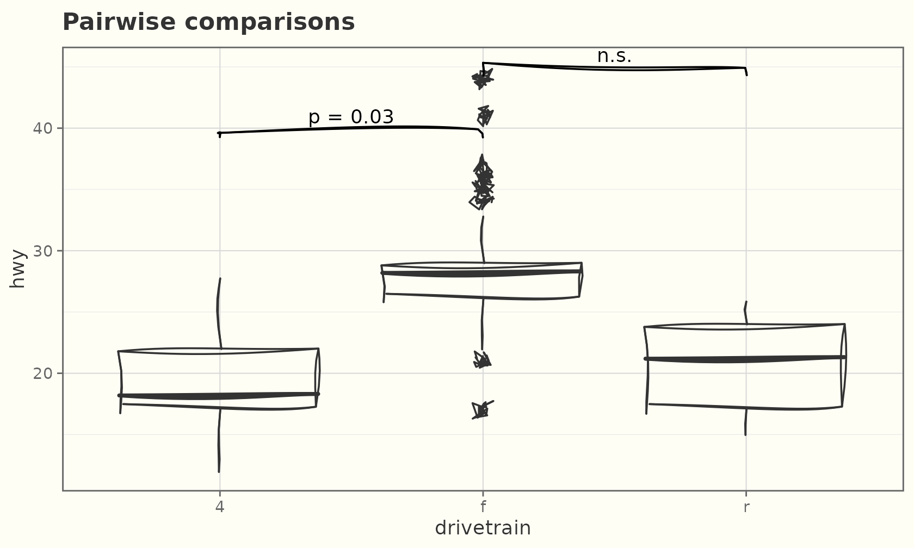

## Composition: facets, scales, coords

Sketch geoms respect the full grammar.

``` r

ggplot(mpg, aes(displ, hwy)) +
  geom_sketch_point(size = 2.5, colour = "#34495E", seed = 9L) +
  geom_sketch_smooth(method = "lm", formula = y ~ x, seed = 10L) +
  facet_wrap(~drv, labeller = label_both) +
  labs(title = "Faceted by drivetrain") +
  theme_sketch()
```

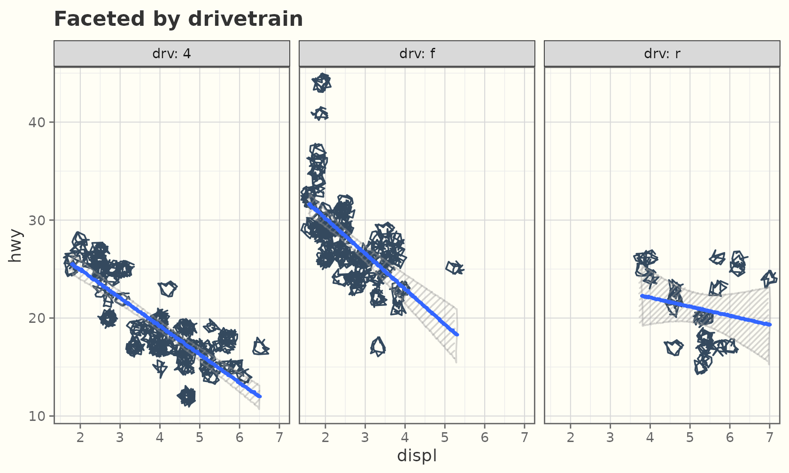

## Dark mode

Every example above works with `theme_sketch(dark = TRUE)`:

``` r

ggplot(sales, aes(product, units, fill = product)) +
  geom_sketch_col(seed = 1L, show.legend = FALSE) +
  scale_fill_brewer(palette = "Set2") +
  labs(title = "Dark preset", x = NULL) +
  theme_sketch(dark = TRUE)
```

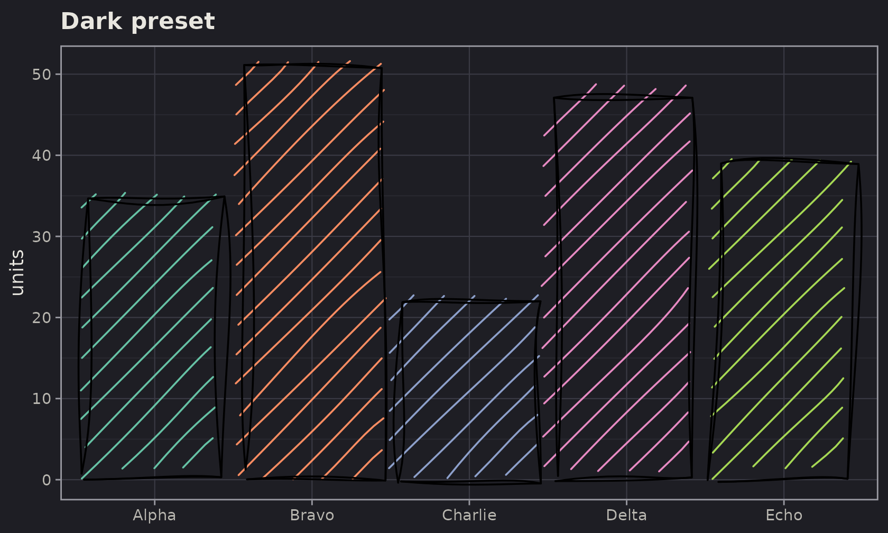

## A hand-drawn frame

By default
[`theme_sketch()`](https://orijitghosh.github.io/ggsketch/reference/theme_sketch.md)
keeps the gridlines, panel border, and axis ticks crisp. Pass
`rough_frame = TRUE` and the frame is roughened too, so it matches the
marks.

``` r

ggplot(sales, aes(product, units)) +
  geom_sketch_col(fill = "#7BAFD4", seed = 1L) +
  labs(title = "Everything wobbles", x = NULL) +
  theme_sketch(rough_frame = TRUE, seed = 1L)
```

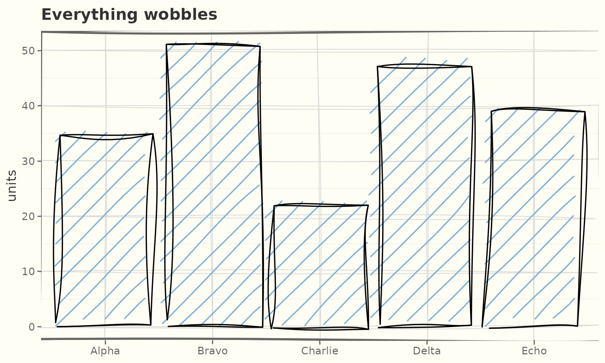

The roughened elements are real theme elements —
[`element_sketch_line()`](https://orijitghosh.github.io/ggsketch/reference/element_sketch_line.md)
and
[`element_sketch_rect()`](https://orijitghosh.github.io/ggsketch/reference/element_sketch_line.md)
— so you can also drop them into any theme yourself and tune their
`roughness`, `bowing`, and `seed`:

``` r

ggplot(mtcars, aes(wt, mpg)) +
  geom_sketch_point(seed = 1L) +
  theme_sketch() +
  theme(
    panel.grid.major = element_sketch_line(roughness = 0.8, seed = 7L),
    axis.ticks       = element_sketch_line(roughness = 0.6, seed = 8L)
  )
```

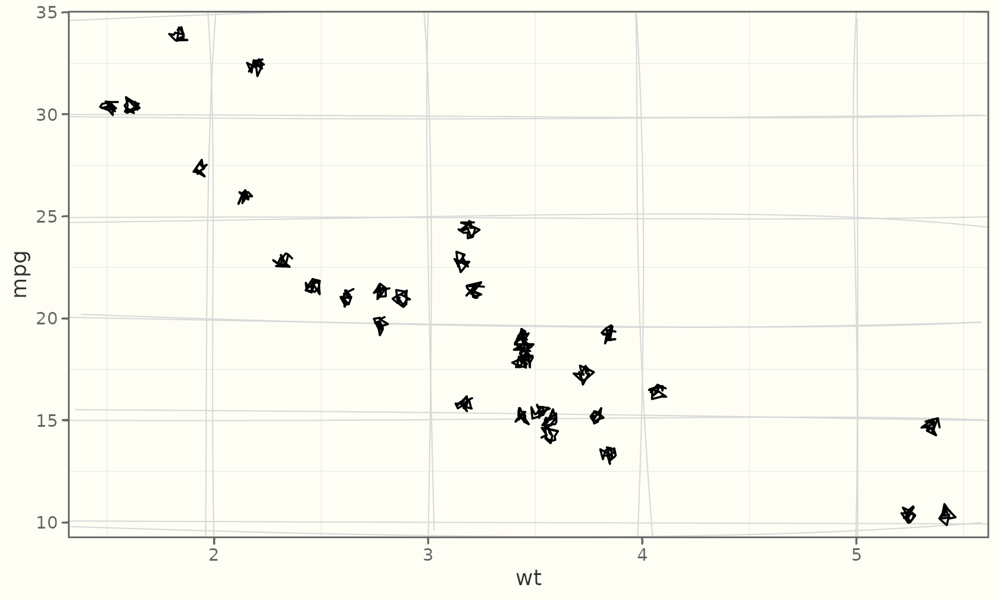

## A matching palette

[`scale_colour_sketch()`](https://orijitghosh.github.io/ggsketch/reference/scale_sketch.md)
/
[`scale_fill_sketch()`](https://orijitghosh.github.io/ggsketch/reference/scale_sketch.md)
use a qualitative palette
([`sketch_palette()`](https://orijitghosh.github.io/ggsketch/reference/sketch_palette.md))
chosen to suit the hand-drawn look:

``` r

ggplot(mpg, aes(displ, hwy, colour = drv)) +
  geom_sketch_point(size = 2.5, seed = 1L) +
  scale_colour_sketch() +
  labs(title = "scale_colour_sketch()") +
  theme_sketch(rough_frame = TRUE, seed = 2L)
```

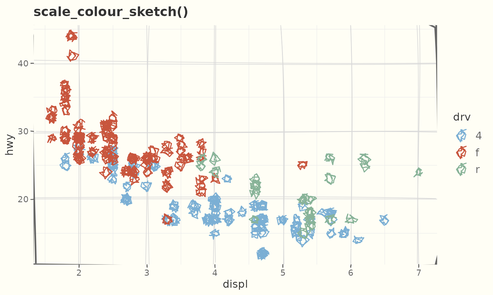

For continuous data the `*_sketch_c()` variants give an ink-on-paper
gradient:

``` r

ggplot(faithful, aes(eruptions, waiting, colour = waiting)) +
  geom_sketch_point(size = 2.5, seed = 1L) +
  scale_colour_sketch_c() +
  labs(title = "scale_colour_sketch_c()") +
  theme_sketch()
```

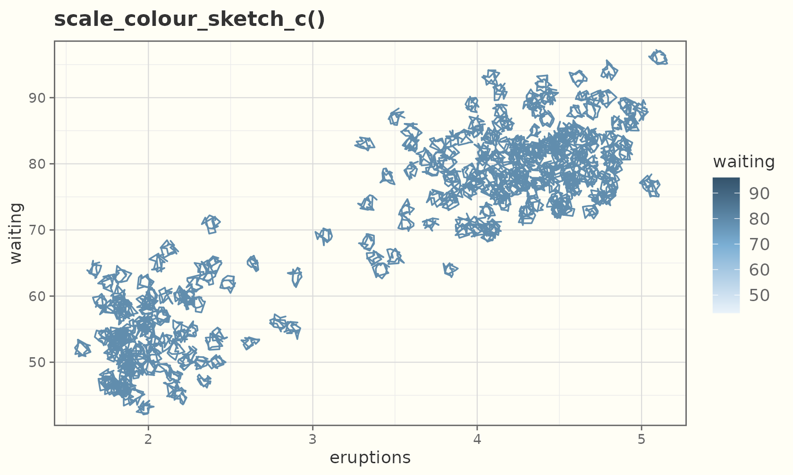

## The scribble fill

`"scribble"` is one continuous winding stroke that overshoots the
boundary, like scribbling to fill a shape:

``` r

ggplot(sales, aes(product, units, fill = product)) +
  geom_sketch_col(fill_style = "scribble", seed = 3L, show.legend = FALSE) +
  scale_fill_sketch() +
  labs(title = "fill_style = \"scribble\"", x = NULL) +
  theme_sketch()
```

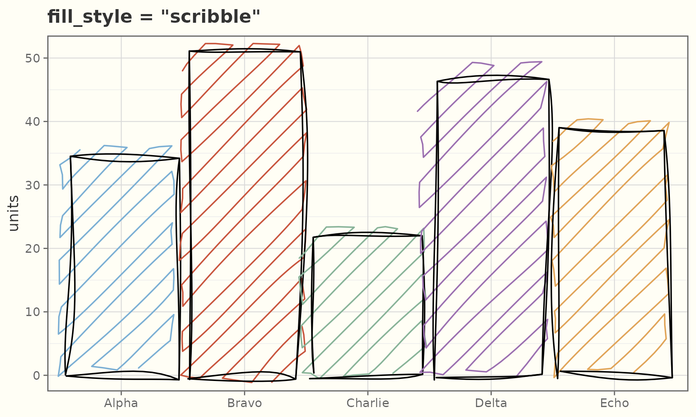

It works anywhere a `fill_style` is accepted. The eight styles:

``` r

styles <- c("hachure", "cross_hatch", "zigzag", "zigzag_line",
            "scribble", "dots", "dashed", "solid")
grid <- expand.grid(col = 1:4, row = 1:2)
grid$style <- styles
ggplot(grid) +
  lapply(seq_len(nrow(grid)), function(i) {
    geom_sketch_rect(
      data = grid[i, ],
      aes(xmin = col - 0.45, xmax = col + 0.45,
          ymin = row - 0.4,  ymax = row + 0.4),
      fill = "#7BAFD4", fill_style = grid$style[i], seed = i
    )
  }) +
  geom_sketch_text(aes(col, row - 0.55, label = style), size = 4) +
  coord_equal() +
  labs(title = "The eight fill styles", x = NULL, y = NULL) +
  theme_sketch() +
  theme(axis.text = element_blank())
```

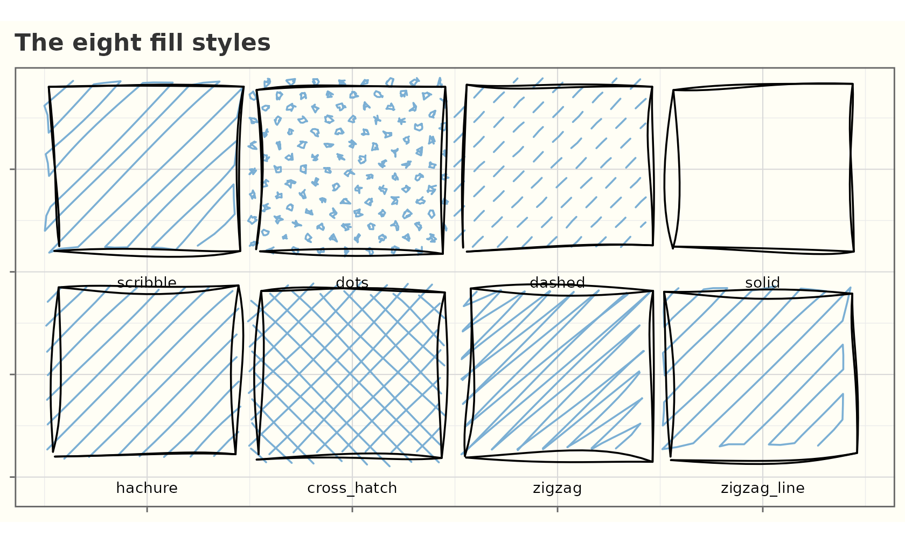

## Reproducible handwriting fonts

[`geom_sketch_text()`](https://orijitghosh.github.io/ggsketch/reference/geom_sketch_text.md)
picks up a handwriting face preinstalled on your OS, but for results
that reproduce on any machine or CI runner, register a font file
explicitly with
[`register_sketch_font()`](https://orijitghosh.github.io/ggsketch/reference/register_sketch_font.md)
and a font-aware device (ragg, svglite, cairo):

``` r

register_sketch_font("Caveat", "path/to/Caveat-Regular.ttf")

ggplot(lab, aes(x, y, label = txt)) +
  geom_sketch_text(family = "Caveat", size = 8) +
  theme_sketch()
```
