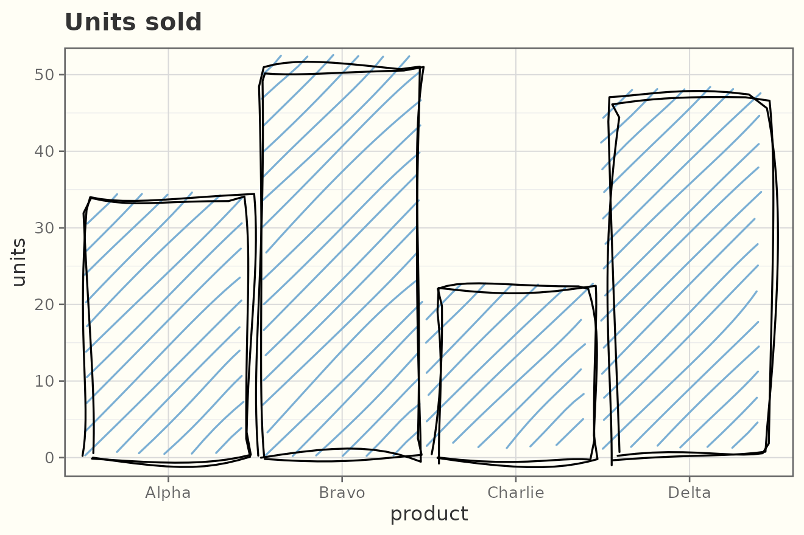
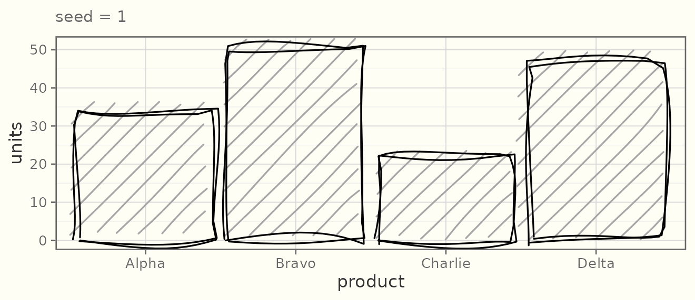
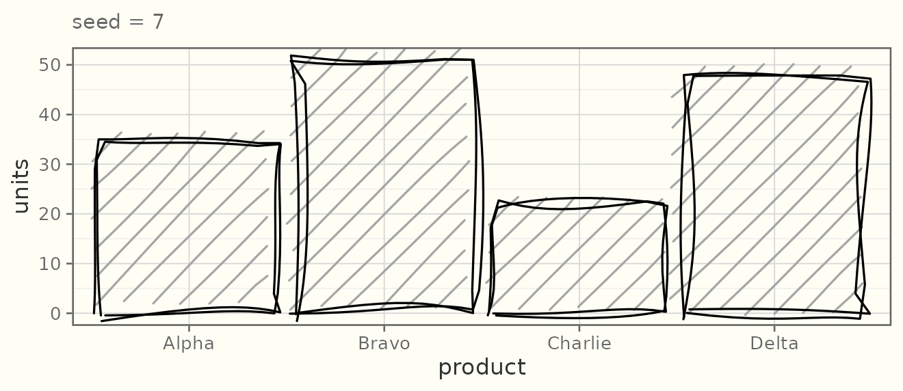
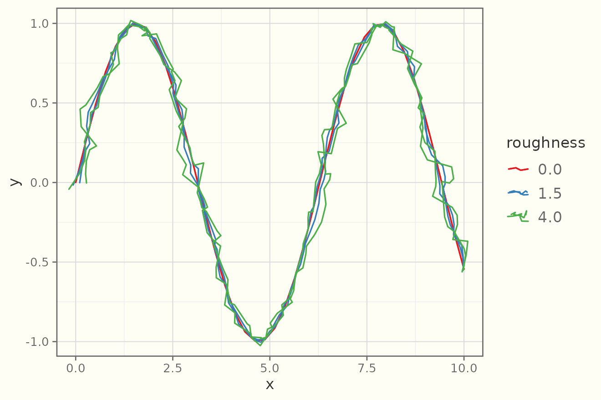
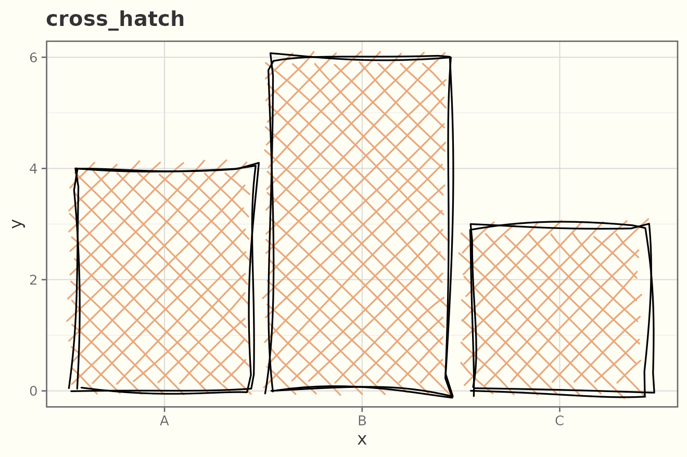
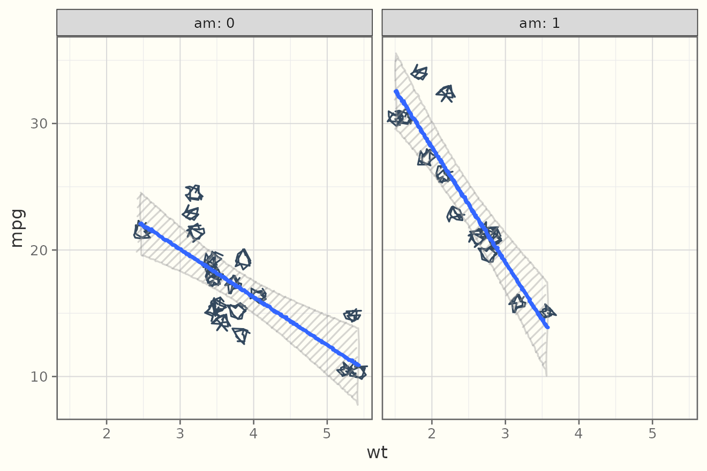
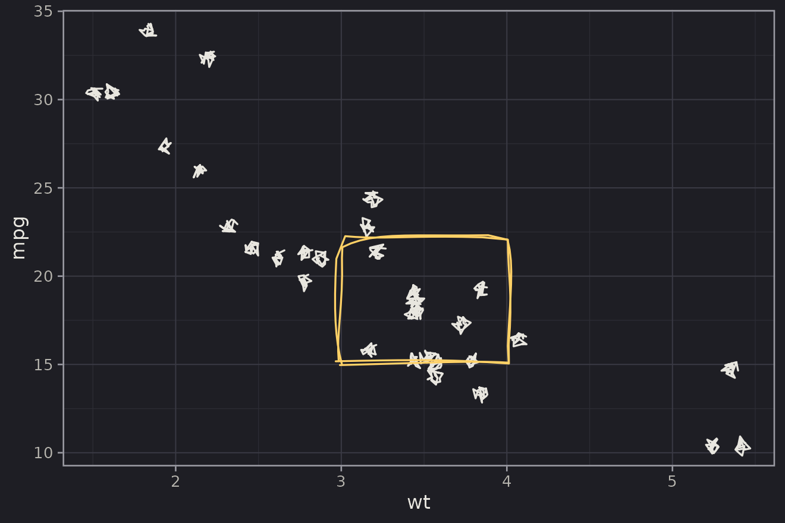

# Getting started with ggsketch

`ggsketch` adds hand-drawn (“sketchy”) geoms to ggplot2. They are real
ggplot2 layers, so they compose with
[`aes()`](https://ggplot2.tidyverse.org/reference/aes.html), stats,
scales, facets, and coords, and they render on every graphics device —
no JavaScript, no browser.

``` r

library(ggplot2)
library(ggsketch)
```

## A first plot

[`geom_sketch_col()`](https://orijitghosh.github.io/ggsketch/reference/geom_sketch_col.md)
draws bars with a roughened outline and a hachure (pencil-shading) fill:

``` r

df <- data.frame(product = c("Alpha", "Bravo", "Charlie", "Delta"),
                 units   = c(34, 51, 22, 47))

ggplot(df, aes(product, units)) +
  geom_sketch_col(fill = "#7BAFD4", seed = 1L) +
  labs(title = "Units sold") +
  theme_sketch()
```



## Reproducible wobble

The sketch look is random, but **seeded** — a given `seed` always
produces the same drawing, so your figures are reproducible. Change the
seed for a fresh “hand”.

``` r

base <- ggplot(df, aes(product, units)) + theme_sketch()
base + geom_sketch_col(seed = 1L) + labs(subtitle = "seed = 1")
```



``` r

base + geom_sketch_col(seed = 7L) + labs(subtitle = "seed = 7")
```



Set a session-wide default with `options(ggsketch.seed = 1L)`.

## The roughness dial

`roughness` controls how far points are displaced (0 = ruler-straight):

``` r

x <- seq(0, 10, length.out = 40)
d <- data.frame(x = x, y = sin(x))

ggplot(d, aes(x, y)) +
  geom_sketch_line(aes(colour = "0.0"), roughness = 0,   seed = 2) +
  geom_sketch_line(aes(colour = "1.5"), roughness = 1.5, seed = 2) +
  geom_sketch_line(aes(colour = "4.0"), roughness = 4,   seed = 2) +
  scale_colour_brewer("roughness", palette = "Set1") +
  theme_sketch()
```



## Fill styles

Filled geoms
([`geom_sketch_col()`](https://orijitghosh.github.io/ggsketch/reference/geom_sketch_col.md),
[`geom_sketch_rect()`](https://orijitghosh.github.io/ggsketch/reference/geom_sketch_rect.md),
[`geom_sketch_polygon()`](https://orijitghosh.github.io/ggsketch/reference/geom_sketch_polygon.md),
…) take a `fill_style`:

`fill_style` is a layer parameter, so to show several you draw one layer
(or panel) per style. Here is `cross_hatch`:

``` r

bars <- data.frame(x = c("A", "B", "C"), y = c(4, 6, 3))
ggplot(bars, aes(x, y)) +
  geom_sketch_col(fill = "#E8A87C", fill_style = "cross_hatch", seed = 4) +
  labs(title = "cross_hatch") +
  theme_sketch()
```



The available styles are `"hachure"`, `"cross_hatch"`, `"zigzag"`,
`"zigzag_line"`, `"dots"`, `"dashed"`, and `"solid"`.

## Composing like any ggplot2 layer

Sketch geoms respect facets, scales, and coords:

``` r

ggplot(mtcars, aes(wt, mpg)) +
  geom_sketch_point(size = 2.5, colour = "#34495E", seed = 9) +
  geom_sketch_smooth(method = "lm", formula = y ~ x, seed = 10) +
  facet_wrap(~am, labeller = label_both) +
  theme_sketch()
```



## Annotations and a dark theme

``` r

ggplot(mtcars, aes(wt, mpg)) +
  geom_sketch_point(colour = "#E8E6DF", seed = 1L) +
  annotate_sketch("rect", xmin = 3, xmax = 4, ymin = 15, ymax = 22,
                  fill = NA, colour = "#FFD166", seed = 2L) +
  theme_sketch(dark = TRUE)
```



## Where the look comes from

`ggsketch` is built in three layers: pure geometry (numbers → numbers),
grid grobs that roughen in device-inch space inside `makeContent()`, and
ggproto geoms. The algorithms are reimplemented in original R from the
published descriptions of the rough.js algorithms and the hachure
approach of Wood et al.; no rough.js source is included. See
`inst/NOTICE`.
