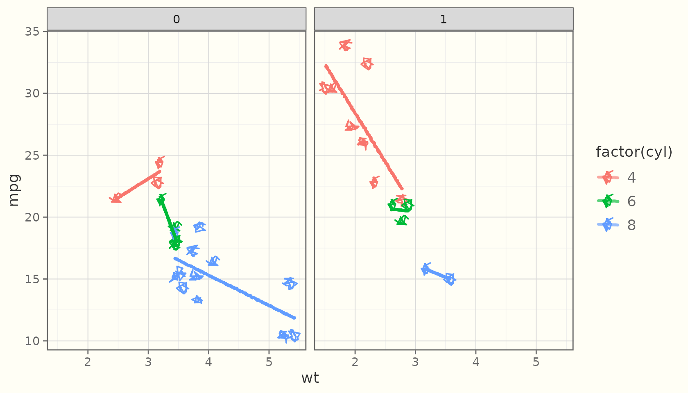

# How it works

ggsketch is built in three strictly separated layers. Keeping them apart
is what makes the package testable, device-independent, and
reproducible.

## Layer 1 — pure geometry

The `core-*` functions map **numbers to numbers**. They take coordinates
and sketch parameters and return roughened coordinates — no grid, no
ggplot2, no drawing. This is where the rough.js *algorithms* are
reimplemented in original R: point roughening, cubic-Bézier sampling,
ellipse generation, and an Active-Edge-Table scan-line filler for
hachure (including concave polygons). ggsketch 2.0 adds more
pure-geometry modules in the same spirit — variable-width stroke ribbons
([`stroke_ribbon()`](https://orijitghosh.github.io/ggsketch/reference/stroke_ribbon.md)),
watercolour washes
([`watercolor_wash()`](https://orijitghosh.github.io/ggsketch/reference/watercolor_wash.md)),
paper textures
([`paper_primitives()`](https://orijitghosh.github.io/ggsketch/reference/paper_primitives.md)),
and a squarified treemap layout
([`treemap_layout()`](https://orijitghosh.github.io/ggsketch/reference/treemap_layout.md)).

You can call them directly:

``` r

# Two passes of a roughened polyline through three points
passes <- roughen_polyline(x = c(0, 1, 2), y = c(0, 1, 0),
                           roughness = 1, n_passes = 2, seed = 1L)
length(passes)       # one matrix per pass
#> [1] 2
head(passes[[1]])    # x/y coordinates of the first stroke
#>                x           y
#> [1,] -0.01208118 0.002597418
#> [2,]  0.10504600 0.093487679
#> [3,]  0.21350587 0.181953799
#> [4,]  0.31377351 0.267744807
#> [5,]  0.40632397 0.350609732
#> [6,]  0.49163232 0.430297605
```

``` r

# Hachure fill of a unit square: a list of line segments
segs <- hachure_fill(c(0, 1, 1, 0), c(0, 0, 1, 1),
                     hachure_gap = 0.2, hachure_angle = 45, seed = 1L)
length(segs)
#> [1] 6
```

Because Layer 1 is pure, the package’s primary regression tests are
deterministic **geometry snapshots** — they compare these numbers
exactly, which is far more stable than comparing rendered images.

## Layer 2 — grid grobs

The `*_grob()` constructors wrap Layer 1 in grid grobs whose
`makeContent()` method does the drawing. Crucially, roughening happens
**after** converting to absolute device inches:

``` r

g <- sketch_path_grob(x = c(0.1, 0.5, 0.9), y = c(0.2, 0.8, 0.5),
                      roughness = 1, seed = 1L)
class(g)
#> [1] "SketchPathGrob" "gTree"          "grob"           "gDesc"
```

Working in inch space (not data or npc space) means the wobble has a
consistent physical scale regardless of the panel’s aspect ratio or the
output device — and because `makeContent()` re-runs on each draw,
resizing a plot re-roughens cleanly at the new size instead of
stretching a cached path.

## Layer 3 — ggproto geoms

The `geom_sketch_*()` functions are ordinary ggplot2 layers built with
the public extension API (`ggproto`, `draw_panel`/`draw_group`,
`coord$transform`, `draw_key`). That is why they compose with everything
in the grammar:

``` r

ggplot(mtcars, aes(wt, mpg, colour = factor(cyl))) +
  geom_sketch_point(seed = 1L) +
  geom_sketch_smooth(method = "lm", formula = y ~ x, se = FALSE, seed = 2L) +
  facet_wrap(~am) +
  theme_sketch()
```



## Determinism

Every randomized routine draws from a **seeded local RNG stream** and
restores the global random state afterwards. So sketch plots are
reproducible given a `seed`, and they never disturb
[`set.seed()`](https://rdrr.io/r/base/Random.html) elsewhere in your
code:

``` r

set.seed(99)
before <- runif(1)

# draw something sketchy (consumes randomness internally)
invisible(roughen_polyline(c(0, 1), c(0, 1), seed = 1L))

set.seed(99)
after <- runif(1)
identical(before, after)   # TRUE — global RNG untouched
#> [1] TRUE
```

## Credits & non-affiliation

The algorithms are reimplemented in original R from the **published
descriptions** of the [rough.js](https://github.com/rough-stuff/rough)
algorithms ([Preet Shihn,
2020](https://shihn.ca/posts/2020/roughjs-algorithms/)) and the hachure
approach of Wood et al. No rough.js source is vendored, copied, or
translated, and no JavaScript ships in the package.

> ggsketch is an independent R package reimplementing the hand-drawn
> sketch aesthetic from first principles. It is not affiliated with,
> derived from, or endorsed by the rough.js project, ggrough, or any
> related JavaScript libraries.

rough.js is © Preet Shihn and licensed MIT. ggsketch is licensed MIT.
See `inst/NOTICE` for the full attribution.
