# Theming & fonts

The sketchiness of the *marks* comes from the geoms.
[`theme_sketch()`](https://orijitghosh.github.io/ggsketch/reference/theme_sketch.md)
styles the surrounding frame — typography, gridlines, background — with
a muted palette to match.

## Light and dark presets

``` r

sales <- data.frame(product = c("Alpha", "Bravo", "Charlie", "Delta"),
                    units   = c(34, 51, 22, 47))

ggplot(sales, aes(product, units, fill = product)) +
  geom_sketch_col(seed = 1L, show.legend = FALSE) +
  scale_fill_brewer(palette = "Set2") +
  labs(title = "Light (paper) preset", x = NULL) +
  theme_sketch()
```

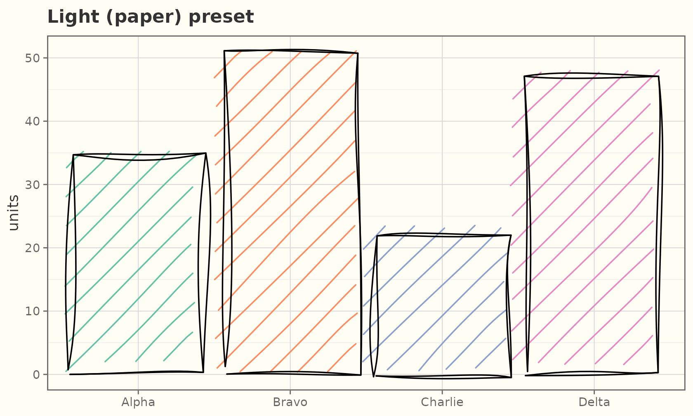

``` r

ggplot(sales, aes(product, units, fill = product)) +
  geom_sketch_col(colour = "grey85", seed = 1L, show.legend = FALSE) +
  scale_fill_brewer(palette = "Set2") +
  labs(title = "Dark (chalkboard) preset", x = NULL) +
  theme_sketch(dark = TRUE)
```

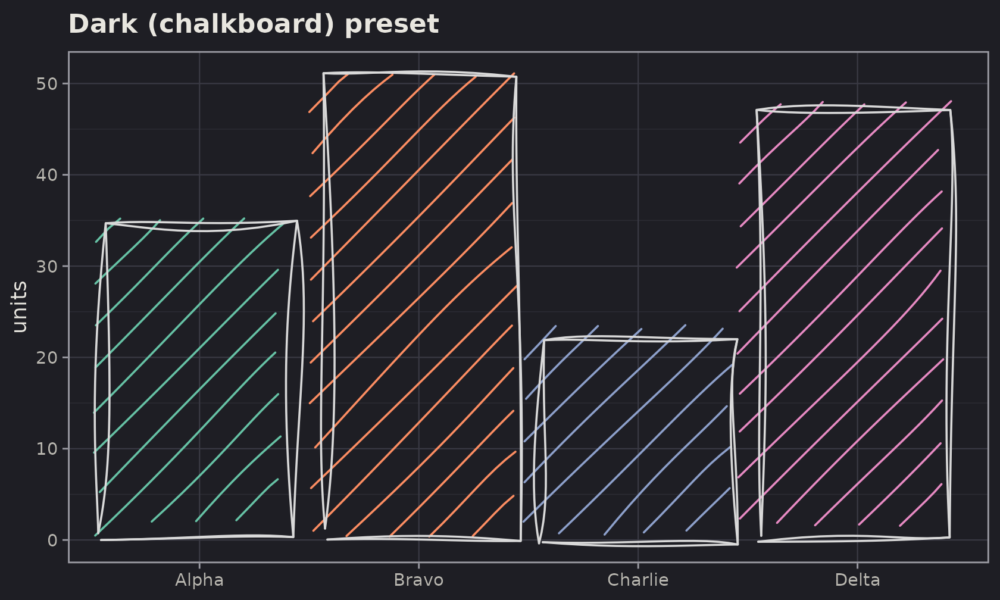

On a dark background, give the geoms a light outline `colour`
(e.g. `"grey85"`) so the rough strokes read clearly.

## The sketch palette

[`scale_colour_sketch()`](https://orijitghosh.github.io/ggsketch/reference/scale_sketch.md)
/
[`scale_fill_sketch()`](https://orijitghosh.github.io/ggsketch/reference/scale_sketch.md)
apply a muted qualitative palette
([`sketch_palette()`](https://orijitghosh.github.io/ggsketch/reference/sketch_palette.md))
tuned for the hand-drawn look; the `*_sketch_c()` variants give a
continuous ink-on-paper gradient.

``` r

ggplot(mpg, aes(displ, hwy, colour = drv)) +
  geom_sketch_point(size = 2.5, seed = 1L) +
  scale_colour_sketch() +
  labs(title = "scale_colour_sketch()") +
  theme_sketch()
```

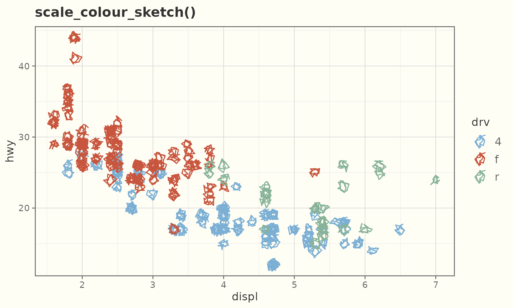

``` r

ggplot(faithful, aes(eruptions, waiting, colour = waiting)) +
  geom_sketch_point(size = 2.5, seed = 1L) +
  scale_colour_sketch_c() +
  labs(title = "scale_colour_sketch_c()") +
  theme_sketch()
```

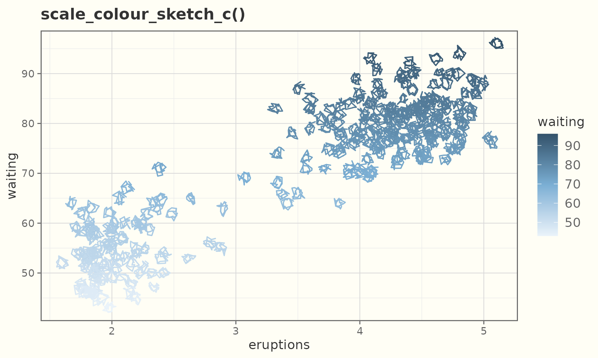

## Textured paper

`theme_sketch(paper = )` draws the panel on a textured ground.
[`sketch_papers()`](https://orijitghosh.github.io/ggsketch/reference/sketch_papers.md)
lists them; dark grounds (blueprint, chalkboard) flip the text and grid
to a light ink automatically.

``` r

sketch_papers()
#> [1] "none"       "notebook"   "graph"      "dotted"     "aged"      
#> [6] "blueprint"  "chalkboard" "kraft"
```

``` r

ggplot(sales, aes(product, units, fill = product)) +
  geom_sketch_col(seed = 1L, show.legend = FALSE) +
  scale_fill_sketch() +
  labs(title = "paper = \"notebook\"", x = NULL) +
  theme_sketch(paper = "notebook")
```

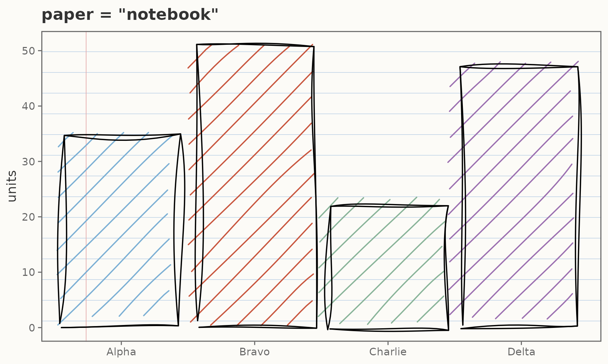

``` r

ggplot(mtcars, aes(wt, mpg)) +
  geom_sketch_point(colour = "white", seed = 1L) +
  labs(title = "paper = \"blueprint\"") +
  theme_sketch(paper = "blueprint")
```

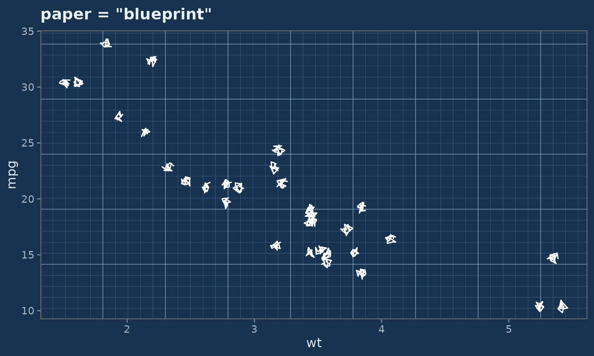

For finer control, drop a paper onto any single theme element with
[`element_sketch_paper()`](https://orijitghosh.github.io/ggsketch/reference/element_sketch_paper.md):

``` r

ggplot(faithful, aes(eruptions, waiting)) +
  geom_sketch_point(colour = "#1F618D", seed = 1L) +
  theme_sketch() +
  theme(panel.background = element_sketch_paper("graph"))
```

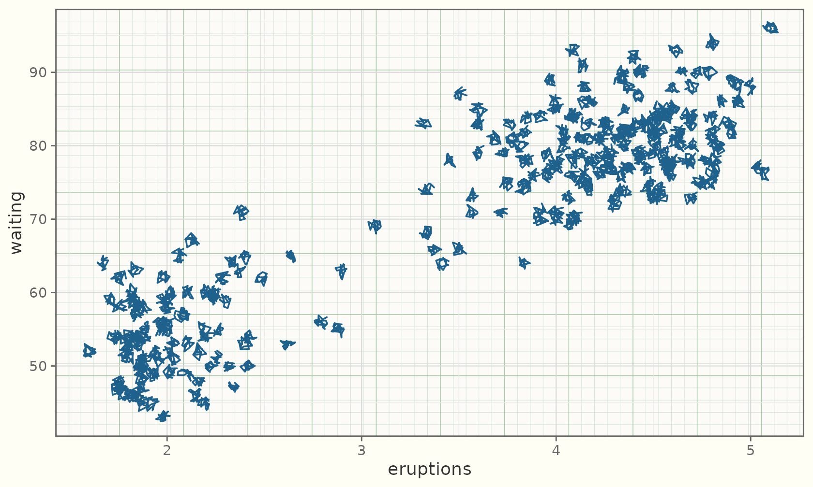

## A hand-drawn frame

By default the gridlines, panel border, and ticks stay crisp.
`rough_frame = TRUE` roughens them to match the marks:

``` r

ggplot(sales, aes(product, units)) +
  geom_sketch_col(fill = "#7BAFD4", seed = 1L) +
  labs(title = "rough_frame = TRUE", x = NULL) +
  theme_sketch(rough_frame = TRUE, seed = 1L)
```

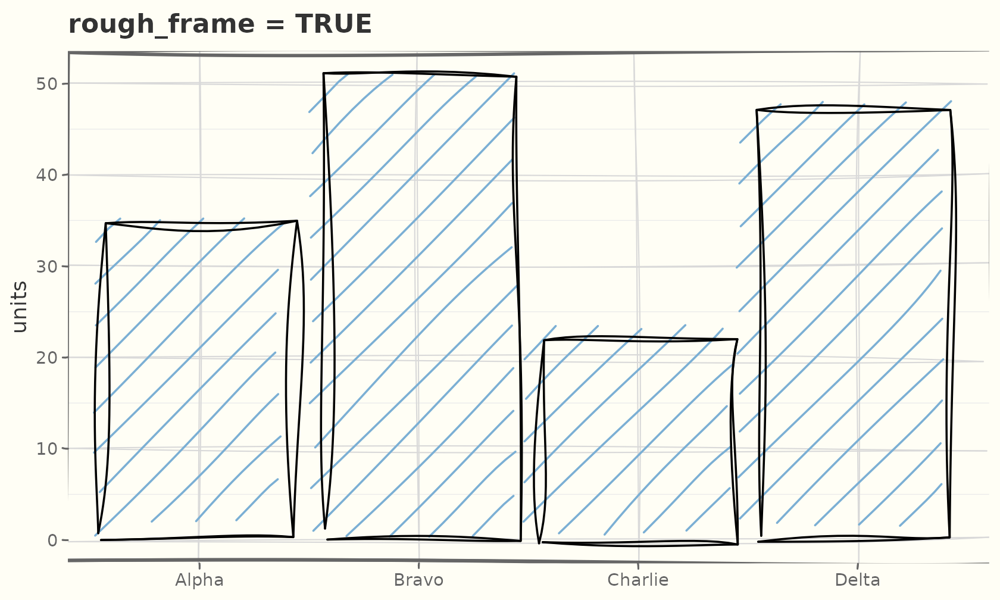

Those are real theme elements —
[`element_sketch_line()`](https://orijitghosh.github.io/ggsketch/reference/element_sketch_line.md)
and
[`element_sketch_rect()`](https://orijitghosh.github.io/ggsketch/reference/element_sketch_line.md)
— so you can roughen individual elements and tune their `roughness`,
`bowing`, and `seed`:

``` r

ggplot(mtcars, aes(wt, mpg)) +
  geom_sketch_point(seed = 1L) +
  theme_sketch() +
  theme(
    panel.grid.major = element_sketch_line(roughness = 0.8, seed = 7L),
    axis.ticks       = element_sketch_line(roughness = 0.6, seed = 8L)
  )
```

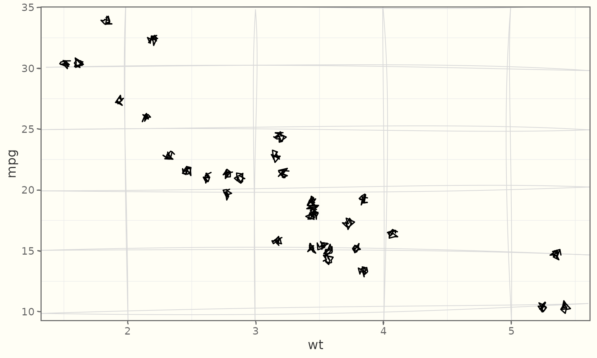

[`coord_sketch()`](https://orijitghosh.github.io/ggsketch/reference/coord_sketch.md)
roughens the frame under *any* theme — even a non-sketch one — and
[`coord_sketch_polar()`](https://orijitghosh.github.io/ggsketch/reference/coord_sketch_polar.md)
does the same for circular plots:

``` r

ggplot(mtcars, aes(wt, mpg)) +
  geom_sketch_point(seed = 1L) +
  labs(title = "coord_sketch() under theme_bw()") +
  coord_sketch(seed = 1L) +
  theme_bw()
```

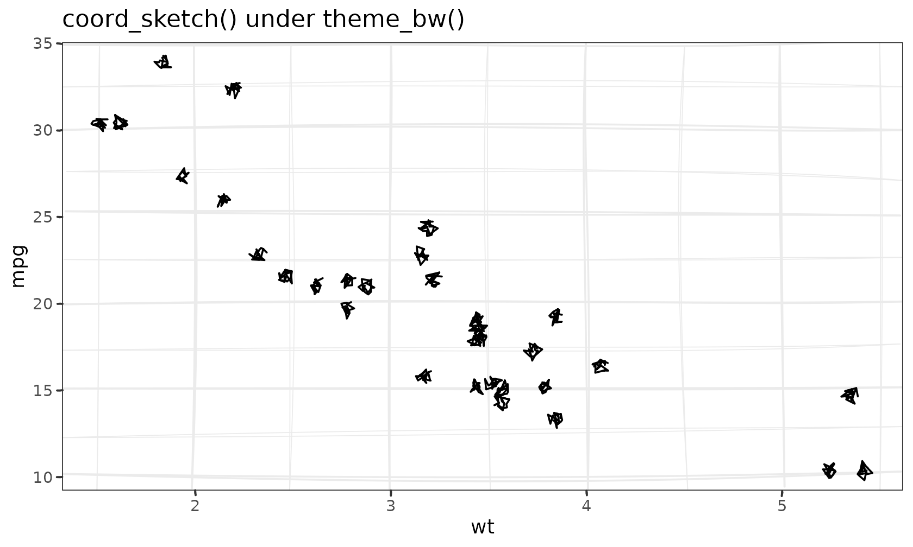

``` r

rose <- data.frame(g = c("a", "b", "c", "d", "e", "f"), v = c(3, 5, 2, 4, 6, 3))
ggplot(rose, aes(g, v, fill = g)) +
  geom_sketch_col(seed = 1L, show.legend = FALSE) +
  scale_fill_sketch() +
  coord_sketch_polar(seed = 1L) +
  labs(title = "coord_sketch_polar()", x = NULL, y = NULL) +
  theme_sketch()
```

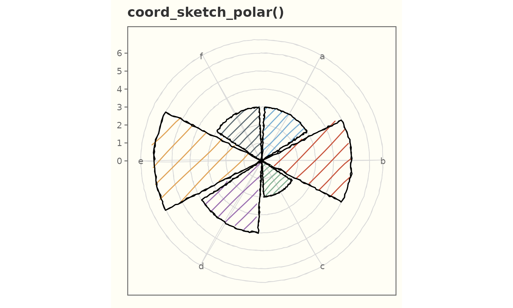

## Base size and the rest of the grammar

[`theme_sketch()`](https://orijitghosh.github.io/ggsketch/reference/theme_sketch.md)
is a normal ggplot2 theme — combine and override freely.

``` r

ggplot(mtcars, aes(wt, mpg)) +
  geom_sketch_point(size = 3, seed = 1L) +
  labs(title = "Bigger base text", subtitle = "theme_sketch(base_size = 15)") +
  theme_sketch(base_size = 15) +
  theme(panel.grid.minor = element_blank())
```

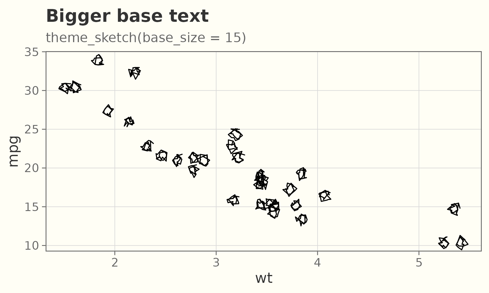

## Handwriting fonts (optional)

The look does **not** depend on fonts, but a handwriting face for the
text adds to it. Pass a family name to `base_family`, or use `"auto"` to
pick the first installed handwriting font (falling back to the device
default if none are found).

### What they look like

A few handwriting faces that pair well with the geoms — Google Fonts
like [Caveat](https://fonts.google.com/specimen/Caveat), [Permanent
Marker](https://fonts.google.com/specimen/Permanent+Marker), and [Indie
Flower](https://fonts.google.com/specimen/Indie+Flower), plus the
handwriting fonts that ship with Windows and macOS (Segoe Print, Ink
Free, Bradley Hand, Chalkboard, Comic Sans MS). The specimen below
renders whichever of those are installed on the build machine.

*No handwriting fonts were found on the build machine, so the specimen
is skipped. Install one of the faces above (or register one — see below)
to see it here.*

### Using one

Pass `base_family = "auto"` to style the whole theme with the first
installed handwriting font;
[`geom_sketch_text()`](https://orijitghosh.github.io/ggsketch/reference/geom_sketch_text.md)
picks it up the same way.

``` r

ggplot(sales, aes(product, units)) +
  geom_sketch_col(fill = "#7BAFD4", seed = 1L) +
  geom_sketch_text(aes(label = units), nudge_y = 2.5, size = 6) +
  labs(title = "base_family = \"auto\"", x = NULL) +
  theme_sketch(base_family = "auto")
```

Check what is available on your machine:

``` r

ggsketch_check_fonts()
#> Available handwriting fonts:
#>   Caveat
```

### Reproducible fonts

To get the *same* face on any machine or CI runner — without relying on
a system install — download a font once (e.g. Caveat from Google Fonts)
and register it with
[`register_sketch_font()`](https://orijitghosh.github.io/ggsketch/reference/register_sketch_font.md),
then render with a font-aware device (ragg, svglite, cairo):

``` r

register_sketch_font("Caveat", "~/fonts/Caveat-Regular.ttf")

ggplot(sales, aes(product, units)) +
  geom_sketch_col(fill = "#7BAFD4", seed = 1L) +
  geom_sketch_text(aes(label = units), family = "Caveat", nudge_y = 2.5, size = 6) +
  labs(title = "Registered font", x = NULL) +
  theme_sketch(base_family = "Caveat")
```

[`ggsketch_check_fonts()`](https://orijitghosh.github.io/ggsketch/reference/ggsketch_check_fonts.md)
and
[`register_sketch_font()`](https://orijitghosh.github.io/ggsketch/reference/register_sketch_font.md)
need the optional `systemfonts` package; without it (or without any
handwriting font), everything still renders with the device default —
ggsketch never makes fonts a hard dependency.
